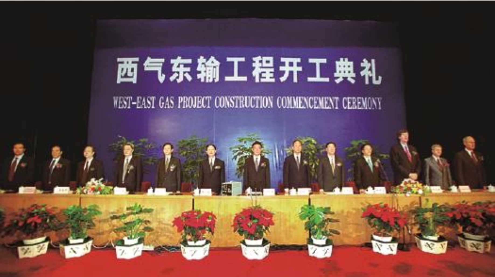
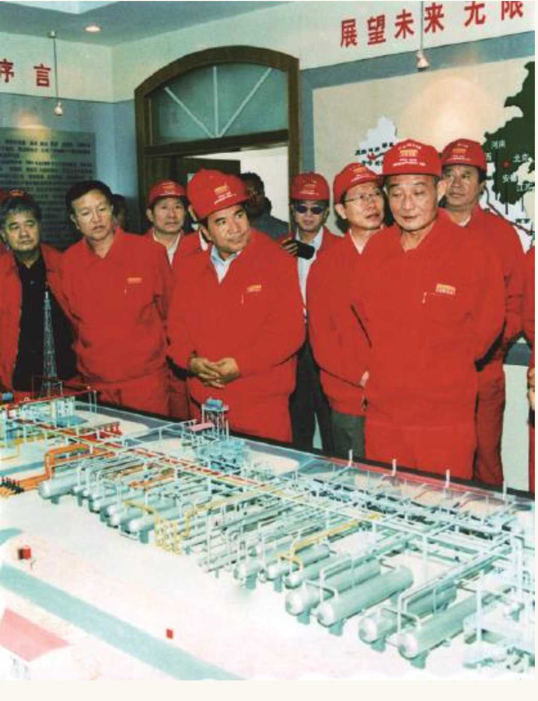

# 
 筚路蓝缕：世纪工程决策建设记述

### 
 西气东输工程决策建设始末

2014年12月30日，西气东输一线迎来正式商运十周年纪念日。这条被称为“能源大动脉”的管道项目构思始于20世纪90年代中期甚至更早的时候，目标是要将“死亡之海”——塔克拉玛干沙漠中的天然气送到中国经济的心脏部位。管道全长约4200公里，年输气量120亿立方米，第一期投资规模达到1400多亿元，是中国西部大开发最重要的能源项目之一。

而十多年前的中国天然气市场，无异于刚出生的婴儿。2000年，中国国内天然气产量仅为272亿立方米，天然气占一次能源消费的比例不过3%，全国的高压管道不过2万公里，大部分为连接单一气田与单一用户而建。在这样稚嫩的上下游条件下，建设一条世界级的长输管线，其挑战空前，质疑之声自然不会少。

十多年后的今天，曾经的质疑都已烟消云散。

“西一线”之后，二线、三线、四线纷纷上马，中亚、缅甸天然气通过跨境管道进入中国，中俄天然气管道也在2014年5月一锤定音。在2016年6月国务院最新发布的《能源发展战略行动计划（2014—2020年）》中，计划到2020年天然气在一次能源消费的比重将达到10%以上。

更重要的是，“西气东输工程的决策和实施给我们留下了许多值得深思的精神财富。重大工程的规划建设需要胆略和战略眼光，要有对历史负责的责任感，要有‘世上无难事，只要肯登攀’的气概”。作为这一重大工程的直接参与者，我想如实呈现15年前浓墨重彩的西气东输工程决策建设始末。

#### 
 在地图上画一条直线

西气东输最早可以追溯到国家“八五”和“九五”计划期间（1991—2000年），最主要是在1995年前后。

我们都知道，我国在1963年建成大庆油田，摘掉了贫油的帽子。大庆石油会战后，不少地质学家又提出，最有可能发现大油田的地方是新疆的塔里木盆地。当时，人们对塔里木寄予了很大的希望，甚至有人乐观地认为，中国“又发现了一个沙特”。因此，当时在全国调了2万多名石油工人去搞塔里木石油大会战。多年的勘探开发，确实带来了一些发现，但比原来的期望值差得较远。

不过，在钻探过程中有不少伴生气冒了出来。由于当时的目标主要是开采石油，对于天然气既没有采集和回注装置，也没有管网建设，因此只能放空点火烧掉。不少去过塔里木参观的人，看到沙漠里“点天灯”的现象，都觉得颇为可惜。有人提出，可以把天然气作为化肥原料利用起来。20世纪90年代，我国化肥还依赖进口，而农业发展又急需化肥，因此国家提出搞“大化肥”项目的设想。

当时，除了新疆塔里木的伴生气，海南的莺歌海也发现了气田。所以，国家提出，以莺歌海和塔里木的天然气为原料，在海南和塔里木各建三套“大化肥”项目的设想。不过，集中新建三套“大化肥”项目的计划，最后并没有彻底实现。在海南，之前有一套海南富岛化肥，之后中海油在海南东方市紧邻富岛化肥又新建了一套“大化肥”。老的一套加上新的一套，后来合并成中海油的富岛化肥厂。在新疆，南部泽普新建了一套20万吨的化肥厂，乌鲁木齐石化则建有30万吨合成氨和52万吨尿素装置。两地都没有实现新建三套“大化肥”项目的计划。塔里木盆地伴生气没有利用的现象仍然存在。

正因如此，早在20世纪80年代末和90年代初，中石油就有人提议将这些天然气收集起来，通过管道外送。中石油副总经理史兴全当时就曾提出设想说，可以在地图上画一条直线，将天然气从新疆送到上海，大体上就是现在西气东输一线的走向。

#### 
 最后还是觉得西气东输是可行的

到了1999年末2000年初，国家经贸委主任盛华仁去了一趟塔里木。回来后，他给国务院总理朱镕基提交了一份报告。大意是，塔里木盆地有不少伴生气，放空烧掉很可惜，而上海是我国经济较发达地区，但亟缺能源。盛华仁提议，可以建设年输送能力在200亿立方米左右的管道项目，将气从塔里木外送到上海。

盛华仁的设想，显然最初是中石油在塔里木的工作人员向他汇报工作时候提出的。当时塔里木油田的总经理是现任中石油集团总经理，比较有激情。具体是谁做了汇报我不清楚，但他们向盛华仁提出了塔里木盆地天然气外送的设想。

收到盛华仁的报告以后，朱镕基总理觉得颇为振奋。我在朱镕基同志领导下工作多年的观察是，他不仅在宏观经济上很有造诣，对重大工程的布局也很有激情，包括西气东输、西电东送和青藏铁路在内的几个大型工程，都是在他主政期间决定的。因此，听到这个提议后，朱镕基同志对西气东输设想产生了很大的兴趣，让主管这块工作的国家计委研究项目的可行性。

那时，我已经出任国家计委副主任，刚好分管这块工作。当时国家计委设有基础产业司分管能源交通工作，分管司长是徐锭明，负责具体工作的还有胡卫平。所以，主要负责西气东输论证工作的就是我、徐锭明和胡卫平等人。当时我们在内心里都很支持建设这项工程。如果不搞西气东输，继续新建“大化肥”项目的话，还需要解决运输问题，那还不如推动天然气管道建设，还能推动全国天然气的布局。

当时国内天然气行业还只是初生，上游勘探开发也不明确，也并不存在下游天然气市场。我要负责具体管道工作的论证，有很多的担忧。到底上游天然气的储量和可能的产量有多少，当时没有确切的数量概念。如果建设了管网却没有气供应，怎么交代？如果要外送天然气，这么长距离，经济上到底划不划算？新疆到上海4000多公里，这种距离的管线在世界上也算是长的，更别说我国此前从未建过这样长的管道。如果建成之后没有效益怎么办？如果工程建设到一半，忽然证实产量没有那么大，又该如何面对投资？……未知的问题有很多。所以，当时对要不要搞西气东输，我心里没有底。

还有一个问题是，我们究竟是应该优先开展西气东输，还是寄希望于东海的天然气资源，优先开发东海？此前，地质部的勘探队伍一直在研究东海的油气资源情况，他们已经发现了平湖油气田。后来地质部进行了改革，负责勘探的队伍成为后来的新星石油公司，而负责平湖油气田开采的就是新星石油公司。2000年开始提出西气东输工程的时候，平湖油气田已经有4亿立方米的天然气产量，就近供应上海。不过，上海能源缺口很大，东海的4亿立方米天然气并不算多。

在发现平湖油气田之前，城市管道都是用煤制成合成的煤气来供应，但这并不是我们现在的煤制气，这种煤气含有氢气、一氧化碳和二氧化碳的成分。当时在中国，多数家庭还在烧蜂窝煤，条件好的家庭能够买到液化气罐，烧的是液化石油气（LPG）；而凡是有管道气供应的城市，大多数是用合成气。上海市在当时已经有管道气了。吴泾是化工产业集中的区域，“煤气”就是在这里生产的。平湖油气田发现以后，东海产的4亿立方米天然气和煤气混在一起出售给老百姓，管道气的热值得到了提高。

但整体上来看，经济发达的长三角地区缺乏能源，依然需要更多的天然气供应。当时并没有液化天然气（LNG）的概念，东海天然气储量也并不确定，所以最后还是觉得西气东输是可行的。

#### 
 张国宝这一次说对了，没有说错

这样巨大的管道工程要求巨额的投资。当时中石油对于摆在面前的这个大工程的态度如何，资金如何筹措，技术上有无保障，是非常重要的。

中石油的态度其实是非常积极的。在塔里木油田一线的干部职工一直都在积极力推西气东输；而在中石油集团公司层面，时任中石油董事长马富才和总经理黄炎、副总经理史兴全也都非常支持。可以想象，如果没有中石油的积极性，光有政府积极性肯定是干不成的。所以，当时政府和企业的态度是完全一致的。

当这个构想酝酿了一段时间以后，2000年2月14日，朱镕基总理召开国务院总理办公会议讨论西气东输工程，由国家计委负责汇报，具体汇报人就是我。

我去汇报时带上了东海的地图。汇报时，开始先讲东海天然气的开发情况──这并不是当时要求汇报的内容。朱镕基总理打断我的话说：“国宝同志，我让你汇报西气东输，你怎么讲东海？”我回答说：“总理，东海和上海毗邻，新疆则距上海4000多公里远，如果我们不把东海目前的开发情况汇报清楚，恐怕后人会质疑我们为何舍近求远。所以，这是汇报西气东输时需要回答清楚的一个重要问题。”

朱镕基总理听完后表示赞同，让我继续先汇报东海的情况。当时，对东海的资源量还属于推测，只有平湖一小块地方在产气。我的汇报认为，要是把宝押在东海上，不确定性太大，也不知道何时能向上海供气。

讲到这里时，朱镕基总理又打断了我，问道：“上海的气多少钱1立方米？”

我马上就回答：“1.56元。”

其实，在这种情况下大部分人应该很难回答出来。说句玩笑话，恐怕连上海市长也不一定清楚这个气价，更别说我当时生活在北京。我连北京气价是多少也不十分清楚，因为家里都是夫人缴气费。

能回答上来完全是一个偶然。在这之前，我偶然读到一张上海的小报，报纸名称我记不清了，大概是《新民晚报》。上面有一篇小豆腐块文章，讲到上海平湖天然气和焦炉气混到一起卖给居民的情况，提到了混合后的气价是1.56元，这个数字就进入了我的脑子里。

朱镕基总理当时一听，第一反应肯定是：这小子是不是顺杆爬，随嘴乱说的？你又不是上海人，怎么能说得这么准确？因为过去有过这样的情况。我陪他到地方视察时，就有干部汇报的数据不实，被朱镕基总理派人当场核实，一旦发现汇报数字不实就狠狠地批评一顿。这次他怀疑我说的不对，便使了一个眼色给他的秘书李伟，让李伟给上海市长徐匡迪打电话核实。

我只看到李伟几次进出，还和朱镕基总理耳语，但并不知道他们在谈什么，还以为是有其他军国大事。过了一会儿，李伟递上了一个条子。朱镕基总理看了一眼后，把纸条反扣在桌子上，拿杯子压起来，继续听汇报。

一直到汇报结束，朱镕基总理才把这个条子拿出来，说：“我刚才听到汇报里上海的气价，不相信张国宝说的这个数字，就让李伟去给徐匡迪打电话。徐匡迪回复了，说上海的混合气价确实是1.56元。所以，张国宝这一次说对了，没有说错。”

两天以后，国务院下发纪要，决定成立西气东输工程建设领导小组。纪要上还有一句话说，由国家计委一位负责此项工作的副主任担任领导小组组长──通常领导小组组长应该是正职担任，纪要虽然没有点我的名，但是根据这个定语的范围，实际上就是我。我就这样当上了西气东输工程建设领导小组的组长。

#### 
 专家非常坚持，我拧不过他们

塔里木盆地是西气东输一线的气源地。在项目论证时，对于塔里木盆地天然气资源量掌握的情况对于决策至关重要。

当时上游最主要的发现是克拉2特大型气田，产量约在1000多万立方米/天，到现在为止仍然是主力气田。

没去看这个气田之前，我一直以为它在塔克拉玛干沙漠边上或是在里边。实际上它是在塔里木沙漠和天山山脉中间的过渡地带，是在一个雅丹地貌深部──就如所谓的魔鬼城一样，充满了红色的、起伏不定的地形，里面寸草不生。

地上地形复杂，地底下又是另外一回事。我们的地质学家很厉害，推算出来这里应该有气。所以用了包括人扛肩抬、直升机吊装等办法，在这雅丹地貌中间打下了克拉2井。这是一口一天能产1000多万立方米气的高产气井。也就是说，塔里木的勘探成果已经为开展西气东输打下了一定的基础。克拉2附近还有一些具有开发前景的气田，如克拉3、大北、迪那2等，这些气井沿着塔克拉玛干沙漠的北侧陆续出现。虽然当时有的气井还没有完全掌握可采储量，但起码可以知道这里的资源量是很有前景的。

到论证的时候，地质学家的推算储量在8000亿—10000亿立方米，预计可采储量3000多亿立方米。而我们觉得，远景储量能达到10000亿立方米以上。我在西气东输论证的会议上汇报时，心里多少还有些打鼓，担心掌握的探明储量不够实现20年每年200亿立方米的持续供应。

在信心不太足的时候，怎么评估出最后要达产120亿立方米/年的运输量？

其实，最初盛华仁同志提出的建议是年产200亿立方米，我们也希望按200亿立方米/年来进行设计。

但那时我国已有规定，凡是重大工程，一定要先进行专家评估，政府官员说了不算。所以，西气东输工程也交给了中国国际工程咨询公司（以下简称“中咨公司”）进行评估。当时评估西气东输的专家组组长是中海油集团公司原副总经理唐振华，他也是中咨公司聘请的专家委员会的顾问委员，后来还是西二线评估组的副组长。

唐振华当时认为，上游可能没有那么多气，而且中国还没有多少人用过天然气，天然气的价格相对较贵，担心下游市场每年消化不了200亿立方米。因此，专家评估提出西气东输的运输量应该砍到120亿立方米/年，管径应该从1034mm缩小到1018mm。

我不认同这一观点。我认为，规划应该为以后的发展留有余地。其实，我们当时已经设想到，万一塔里木天然气储量不足，还可以从中亚相邻的哈萨克斯坦和土库曼斯坦引进天然气。所以，管道输气规模在设计中应留有余地，更何况建设期还有几年，发现的天然气储量只会越来越多。对这一问题争论了很久。我的意见是按200亿立方米/年来设计，工程规划需要留一点余地，就不用日后反复进行扩建。虽然当时看起来120亿立方米/年似乎更有把握，但是万一产量增加，运力就会不足。但这些专家非常坚持，谨慎的意见占上风，我拧不过他们。所以最后还是按照专家意见，西气东输可研报告定了120亿立方米/年，管径是1018mm。

但后来气多了，管容和运力不够，中亚天然气也引了进来，又建设了西气东输二线。

那时候论证西气东输一线，都还害怕市场消化不良，所以开始时没有考虑过西二线和西三线建设。

对于中亚天然气合作的想法，虽然我们当时公开的文字未提此事，但是在讨论时实际已经设想到：万一今后塔里木的天然气资源不够怎么办？对此疑问当时确实有担心。如果确实如专家所言供气不足，我们就想办法从中亚引进来，每年200亿—300亿立方米。

#### 
 各省市当时都不愿意多要

除了上游资源量的不确定性，下游市场的消纳问题也是担忧之一。在我任工程建设领导小组组长时，对下游市场消纳进行了大量工作。

当时下游有很多担忧：其一，中国还没有多少人用过天然气，人们的第一反应是天然气很贵，用不起；其二，万一用上天然气以后，如果气源不稳定忽然断气了怎么办；其三，各地方政府对“照付不议”条款不理解。过去都没听过这一方式，理解成了不管用不用都得付钱，认为是霸王条款。其实，“照付不议”的英文是Take-or-pay，是天然气供应的国际惯例和规则，指在市场变化情况下，付费不得变更，用户用气未达到此量仍须按此量付款；供气方供气未达到此量时，要对用户作相应补偿。而“照付不议”的表述则会给人一种错觉，似乎是个霸王条款，这其实是翻译的问题。所以针对这些担忧，我们就要到每个省市去做工作、去进行解释，也让各地的发改委给当地的用户企业做工作。

西气东输工程上游几省主要是过路，包括山西也没有落地什么气。从河南之后，进入到安徽，然后依次到江苏、上海以及浙江，下游市场就主要是安徽、江苏、上海、浙江这几个省市。当时各省市都有顾虑，不愿意多要。我们就要到各省市做工作，宣传天然气的好处，要各地同意和中石油签天然气购销协议。当时我在北京还专门搞了一个新闻发布会，请沿线各个省市都来人参加，我和中石油的马富才坐在台上进行宣讲。

徐锭明这个人性格和说话都比较急。当时为了宣传西气东输和天然气，他发明了一个著名的词，说这是“鸦片气”──你一旦用上天然气，就知道它的好处了，又干净又方便，一拧阀门气就来了，热值还特别高；“抽”上以后，“想戒都戒不掉”。

但这些都还不够，大家还不放心。后来我们又把沿线的省市领导、发改委主任请到塔里木的轮南进行现场观摩。轮南过去是边疆，很荒凉。中石油在沙漠中找了一块空地，等人都到齐后，当场在沙漠里点火，“砰”一声，火焰就高高地蹿起来，极为壮观，现场的人都赶紧拍照。我们就是用这种办法来让下游各省市接受的。

下游各省市的市场最后落实最积极的是江苏，上海也不错。比较麻烦的是浙江，一直到现在都还有后遗症。

浙江当时虽然很需要气，但有自己的考虑。因为如果东海有气，就可以在宁波登陆供应浙江。所以，我们最初设想以钱塘江为界，钱塘江以北用西气东输的气，钱塘江以南将来可以考虑用东海的气。差不多同时期，在广东和福建建了液化天然气的中海油到浙江省去游说，希望搞液化天然气项目。中海油的身段比较低，合作态度也比较好。

这些因素之下，浙江省希望“肥水不流外人田”。当时浙江省副省长王永明就提出成立一个浙江省管网公司，计划自己建设和管理省内管网，中石油只要把气送到浙江边界的湖州或嘉兴就可以了。浙江省和中海油一拍即合，成立了合资公司。所以现在浙江省内的天然气管网是浙江省和中海油合资的公司；中石油本希望通过自己的管线直接送到浙江省内，但浙江省不干，这让中石油挺生气，最后双方合同签了10亿立方米/年的供应量。

我后来曾经找过王永明副省长，说这种做法不妥──供气的不是中海油一家，单独和中海油合资不好，起码也要把中石油拉进来。他表示同意，但已经晚了，和中石油谈不拢。所以到现在为止，西气东输供到浙江的气还是10亿立方米/年。气也只是送到嘉兴或湖州，浙江省内管网跟中石油并无关系。

但就像我汇报西气东输工程时所说的那样，东海很长时间没有发现新的气田。如果当时把宝押在东海上，至少到现在这么长的时间还是没有足够的天然气供应。

江苏省差点也走了这个模式，后来被我否掉了。当时，江苏省，包括发改委主任在内的一些干部也想组建一个省管网和燃气公司，人都已经选好了。那时候李源潮同志是江苏省委书记，具体分管此事的则是副省长吴瑞林，他原来是南京金陵石化的总经理。那年两会期间，江苏省代表团住在亚运村附近的五洲大酒店，晚上我到酒店找李源潮书记，建议他让中石油负责把天然气直接送到江苏省内，不要单独再搞管网公司，具体到下面各市，就让市自己负责，最后李源潮书记接受了我的建议。后来，江苏省认购了60亿立方米/年，江苏省主干网也由中石油来负责建设。

这样一步一步，我们逐渐说服每个省市和中石油签下了“照付不议”协议。

#### 
 各部门的协调非常复杂

当时确定管线路径和管输费用也很重要。

2000年七八月之际，我们在北戴河向国务院总理办公会汇报西气东输工程可行性研究工作。当时，我和徐锭明、胡卫平做了个幻灯片，里面有三四个可选的工程路线方案。

一条就是现在的路线，在陕北走靖边，在靖边可以和陕京管线相连接。出靖边后进入山西省，再从山西到河南，在郑州过黄河；而另一种则不经过山西省，从陕北南下到西安的临潼，从潼关出关进入河南的灵宝。还有一种方案是不走靖边，沿着陇海铁路直接走西安，然后再进入河南。最后选择了第一种方案。

我们当时更倾向于管道走靖边，与陕京管线连接起来。因为当时在长庆油田已经发现有天然气，可以和西气东输的气源相互调节。东可送上海，北可经陕京管线送到北京。

而管输费和输电费的问题一样，都由价格司决定。定价原则是成本覆盖加适当利润。当时全线的平均管输费是每立方米0.84元，而井口气价每立方米才0.49元，管输费比井口价还要贵，两者相加的价格全线平均是每立方米1.33元。先算出一个全线平均价，然后根据距离远近，各个省市的管输费距离远的多一点，距离近的就少一点。

那个时候各省市提的意见，管输费应该按照距离远近略有差异。到安徽便宜一点，到江苏稍微贵一点，到上海再贵一点。后来就按照这个原则给每个省定一个气价，离得近的价钱就便宜一点。

西气东输的下游市场目标定在了长三角几省市。但在设计管道工程走向时要评估沿线市场潜力和工程技术的特点来决定线路走向，需要做好途经省市的工作。

实际上主要并不是按照沿线的市场潜力，而是完全根据路线本身的工程特点进行设计的。西气东输经过甘肃的路程最长，要求甘肃省政府做很多工作，要征地需要和老百姓沟通。而管道对甘肃来讲主要是过路，但当地的人很讲政治，在西气东输这样的国家任务面前，甘肃省委省政府一直都积极给予支持。

那个时候要用汽车运送管子，一辆车最多运十几根，一直从东部运到新疆去。而沿途公路都有关卡，要交过路费，但这些车刷上一条标语：西气东输。关卡每每看到“西气东输”四字，就免费放行。再比如，西气东输经过河南省时，要穿越黄河，向当地农民征用林地赔偿的问题也产生过纠纷。这些问题，中石油和国家计委都没法摆平，我们就找了河南省委省政府帮忙。由地方政府出面与农民进行协商。各地方政府帮着做了很多这样的工作。

再举个例子，当时西气东输管道要在南京穿越长江，负责施工的是中国台湾的中鼎公司，因为他们有江底穿越的建设经验。江底隧道穿越的工程建设其实很危险，因为如果施工过程中一旦停电，江底下一片漆黑，水泵一旦排不了水，会发生灌入江水淹掉的可能。为了保证安全，就一定要有多条供电线路供电，其中就要从南京的栖霞山接一条线路，当时江苏省南京市都无偿地照办了。沿途有很多这种感人的事迹，尤其是像甘肃、河南等省份。故事太长，三天三夜也讲不完。

管道工程牵涉多个省份及诸多部门，协调工作量很大，是个非常复杂的问题。

比如，西气东输要经过的地方很多已有铁路了，管线要从铁路底下钻过去，需要铁道部同意；同样，穿越公路要征得交通部同意；穿越黄河、长江等河流要征得水利部同意；占用林地要林业部同意。西气东输工程要三次穿越黄河──两次要从河底下穿过去。黄河是游动的，在郑州的黄河河道有20多公里宽，要用五段顶压法穿越。要打五口沉井下去，在井下把管子顶推过去，再从下一个井冒上来，然后再从第二口井往下一个井顶推，这需要很多部门的互相配合。比如小浪底调沙调水了，如果没有通知施工人员，那这口井就被冲掉了。又比如，管道要经过罗布泊原子弹试验基地的一角，这里属于军事禁区，必须要有中央军委的同意才能穿过。

还有很多想象不到的问题。比如，文物局突然提出意见，说管道穿过古长城了，不能穿。甚至到了上海，还有问题。当时进上海的第一站要经过白鹤镇。这个地方有个棚户区，有很多仓库，所以上海希望管道经过此地，正好进行拆迁工作。但对中石油来说，这样要多花很多钱，他们就不愿意走。这些工作都需要我们出面进行大量的协调。

在上海的事情上，就是我出面去找当时的上海市长韩正同志，最后韩正同志协调才解决的。这里面各个部门的协调非常复杂。
