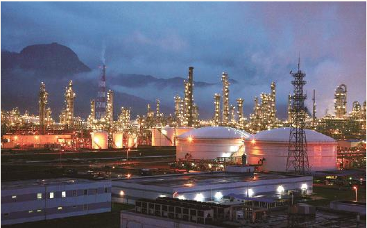

# 
 筚路蓝缕：世纪工程决策建设记述

### 
 祖国内地为香港持续繁荣稳定提供能源保障

东方之珠香港回归祖国后，保持香港的持续繁荣稳定是中央政府和香港特别行政区政府的重要工作任务。早在香港回归前，长期以来香港的副食品供应等民生用品就主要靠内地来保障，即使是在国民经济困难时期，经周恩来总理批准，每天都有几列的鲜活农副产品通过落马洲口岸送往香港。从1965年开始，也是经周恩来总理批准，从深圳向香港供应淡水，并且逐年增加，后来又建设了东江向香港的供水工程。香港回归祖国后，内地与香港的交往更加密切，交通、能源等基础设施需要两地相互协调和照应。经国务院批准成立了内地与港澳基础设施联络小组。内地由我任组长，香港由时任政务司司长任组长，澳门由何厚铧特首任组长。例如，广州南沙的集装箱码头的建设规模与香港葵涌九号码头作了协调，包括西部通道，将京珠高速公路终点延伸到澳门等，联络小组都作了沟通衔接和促进。

香港的电力供应主要由中华电力和港灯两家企业在经营。早在大亚湾核电站建设时，香港的中华电力就是主要股东之一，参与投资大亚湾核电站，解决了当时建设大亚湾核电站中央政府不拿钱要利用外资来解决资金和外汇的问题。大亚湾核电站的电力有相当一部分要送往香港。大亚湾核电站的建成实现了向香港的供电，但是香港仍有600万千瓦左右的燃煤电厂。香港陆地面积狭小，燃煤电厂不仅有排放问题，而且堆煤场和固体废物也将占据一定的面积，而香港的土地资源十分宝贵。当时，邱腾华先生是香港环境局局长，他们的环保意识就很强，有计划要淘汰香港的燃煤电厂。邱腾华先生多次找我，希望能增加从内地购电，逐渐淘汰香港的燃煤电厂。经请示中央，中央政府希望香港特区能保持繁荣稳定，对香港方面提出的要求尽可能予以满足。与我工作有关的，一是香港担心来自海南莺歌海海底管道的天然气供应会逐步减少，希望能通过西气东输管道，延伸建设由深圳到香港的天然气管道，每年向香港供气10亿立方米；二是向香港供电问题。我觉得这对内地和香港都是好事。在我们建设中国第一个LNG接收站——大亚湾LNG接收站时，中华煤气的陈永坚总经理就找到我，希望在接收站中投资一定股份，同时分得相应比例的天然气供应香港。我觉得这对我们建设中国第一个LNG接收站和给香港供气都是好事，所以当场表态我原则同意给中华煤气5%股份。后来港灯也找来，也参股5%。此后中华煤气又从几个小股东手里买了一些股份，实际占股超过了10%。因为深圳大亚湾第一个LNG接收站有珠三角顺德、东莞等城市各百分之几的股份。深圳大亚湾LNG接收站进口气谈判时正值国际液化天然气产能大于需求，通过竞争争取到迄今为止的最低气价，因此香港也从中受益匪浅。

 

 大亚湾核电站

在得到香港特别行政区政府欲使用西气东输二线管道天然气和增加从内地进口电力，压缩本港的燃煤发电的要求后，我立即找了中石油领导，得到中石油领导的支持，同意将西气东输管道延伸到香港。但是海南莺歌海天然气田属中海油，而中海油表示他们有能力继续供应香港天然气20年，每年20亿立方米。如果莺歌海气田产量下降，他们还可开发附近的海上气田来满足供应。但是香港方面仍然认为靠莺歌海气田再供20年没有把握，一旦断气则影响就大了，坚持希望与西气东输二期工程联合向香港供气。我觉得香港的担心是有道理的，同时随着海南的发展，用气需求也会增加，把西气东输二线延伸至香港是正确的选择。因此，说服中海油负责人傅成玉，同意香港的意见。请示港澳办和国务院，他们都很支持这一意见，认为是维持香港繁荣稳定的好事。2008年8月28日，我受中央政府委托赴港签署《关于供气供电问题的谅解备忘录》，内容是向香港20年供气和供电协议。国务院港澳办的陈佐洱副主任也作为代表团成员同行。

赴港后我同时拜访了中华电力，中华电力主要是负责九龙半岛的供电；还拜访了李嘉诚旗下的港灯公司，港灯向香港本岛供电。之前只有中华电力投资了大亚湾核电站，从内地购电，这次港灯也表示有兴趣研究从内地购电。考虑到香港投资者的利益，压缩香港燃煤发电后可以考虑现有大亚湾LNG接收站和核电站的模式，让香港投资者一起来投资，共享利益。我还口头答应可以在粤东地区寻找一个核电厂址，初步定在汕头的汕尾地区，欢迎香港方面采取类似于大亚湾核电站投资的方式共同投资建设向香港供电的核电站。我之所以提出在粤东地区选一厂址，是考虑到珠三角已经有大亚湾和岭澳6台百万千瓦核电机组，在粤西已经有阳江和台山核电站，而粤东还是空白。中华电力开始也很感兴趣。

开始的时候，香港方面是非常积极的，认为核电是清洁能源。但不幸的是2011年初发生了日本福岛核事故，居民恐核情绪上升，香港特区政府担心香港居民的接受程度，对从内地购买核电开始讳莫如深起来，不再像过去那样积极。但是香港并未放弃从南方电网购电的想法，成本也比在香港发电便宜。现在听说，香港中华电力准备用燃气发电替代青山电厂240万千瓦的燃煤发电，这也是好事，可以减少大湾区的环保压力，深圳也表示要逐步关闭曾对深圳特区发展发挥重要作用的沙角燃煤电厂，改用燃气发电。

澳门方面主要是燃油发电机组，而且装机容量比香港小得多，他们对从内地购电一直持积极态度，在当时高油价情况下曾表示可以考虑放弃所有燃油发电，全部改由从内地购电。

2008年9月2日，时任香港特区政府特首特别给我来了一封感谢信，信中写道：“这次签署备忘录，意义重大，不但确保香港获得长期和稳定的天然气和核电供应，更可望更多使用清洁能源，改善本地空气质素，巩固香港作为国际金融中心的地位。这项安排也可减少香港电力公司在特区境内建设天然气接收站的需要以及相关的资本投资，让广大市民无须承担电费上升的压力。”