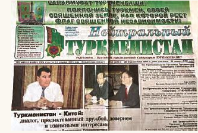
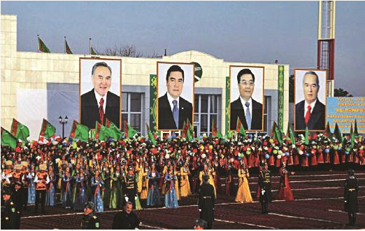

# 
 筚路蓝缕：世纪工程决策建设记述

### 
 中亚天然气管道谈判及决策

2015年12月14日，中亚天然气管道正式开通运营6周年了。6年来，中国通过中亚天然气管道累计进口天然气1350亿立方米，在古老的丝绸之路上建起中国第一条陆上能源进口大动脉。

迄今为止，中国从境外进口天然气管道仅有两条：一条是起自土库曼斯坦的阿姆河右岸，横跨乌兹别克斯坦、哈萨克斯坦直到中国新疆霍尔果斯口岸的中亚天然气管道；另一条是缅甸到云南的缅甸天然气管道。但是，目前通过缅甸天然气管道进口的天然气数量还有限；而俄罗斯西线天然气管道虽签订了意向书、备忘录和一些技术协议，但至今仍未达成商务合同；东线虽然签订了合同并宣称开工，但进展不快，尚未能向中国输气。因此，中亚天然气管道目前是中国陆上进口天然气的最重要渠道。

中亚天然气管道从新疆霍尔果斯口岸进入中国境内，与西气东输二线相连接。中亚的天然气供应到华东的上海、浙江、江苏、江西，华南的广东、广西，并经过深圳到香港的海底管道每年供应香港10亿立方米左右。中亚的天然气还经过西气东输管道到达陕北靖边，再经陕京管道输到北京。有2亿多人口使用上从遥远的中亚输送来的清洁能源。中亚天然气管道的走向恰好沿着古丝绸之路，经过撒马尔罕（乌兹别克斯坦城市）、布哈拉（乌兹别克斯坦城市）等古丝绸之路上的历史名城，跨过戈壁大漠和雪山草原，被誉为新时期建设的能源丝绸之路，与现在实施的共建“一带一路”倡议相契合。

中土乌哈万余名建设者经过两年半的艰苦工作，经受住了沙漠腹地高温、严寒、风沙的严峻考验。夏天沙漠中的气温高达50℃，穿着防护服焊接管道的工人脱下衣服时能从衣服里倒出一盆汗水。上万名建设者在沙漠里工作，蔬菜供应也是一个问题。中国参加施工的是川庆石油公司，他们发扬中国工人吃苦耐劳的精神，在阿姆河边建起无土栽培蔬菜大棚，不仅解决了石油工人的吃菜问题，还可以部分供应给土库曼斯坦居民。2009年12月14日，位于土库曼斯坦阿姆河右岸沙漠腹地的第一个天然气处理厂竣工投产。时任中国国家主席胡锦涛、土库曼斯坦总统别尔德穆哈梅多夫、乌兹别克斯坦总统卡西莫夫、哈萨克斯坦总统纳扎尔巴耶夫共同开启了中亚天然气管道的阀门，宣告中亚天然气管道正式投产运行。土库曼斯坦全国欢腾，举行了盛大隆重的竣工投产仪式。

而早于中亚天然气管道，由西方国家提出的经里海输往欧洲，以绕开俄乌矛盾的纳布科管道却始终没有进展，胎死腹中，至今也未能开工建设。

#### 尼亚佐夫总统首次访问中国前提出建设中亚输气管道

曾任中国驻土库曼斯坦首任大使的程振声曾撰文回忆起最早关于中亚天然气管道的有关构想。土库曼斯坦建国之初制定的《十年稳定》规划中，提出了多元化出口天然气的设想，包括向西、东、南和西南四个方向的管道建设方案。土库曼斯坦的专家们乐观地估计，这个规划即使部分实现，国家也可以实现富强梦。1992年，尼亚佐夫总统首次访问中国前，在接受新华社记者采访时说：“从长远看，我们可能修建从土库曼斯坦经中亚国家通向中国的输气管道项目。”此后，尼亚佐夫总统曾向中国国家领导人提出过向中国供应管道天然气的倡议，但是也许当时条件尚未成熟，得到的都是原则性的回复，未能得到实质性的进展。

中亚天然气管道的构想得到实质性实施，始于2005年5月9日中国国家主席胡锦涛应邀出席在莫斯科举行的卫国战争胜利60周年纪念活动，原苏联各加盟共和国的主要领导人都出席了这一重要活动。在与土库曼斯坦总统尼亚佐夫双边会晤时，尼亚佐夫总统谈到土库曼斯坦有着丰富的天然气资源，可以从土库曼斯坦修建一条天然气管道向中国出口天然气。另一个由外交部举办的活动也帮助推动了建设中亚天然气管道的实施。

当时中国的对外开放越来越深入广泛，经济持续快速增长，中国的能源和矿产资源需求也相应快速增长。为使外交工作更好配合国内经济建设，外交部在京西宾馆召开了一次各驻外使节的会议，由驻外大使们介绍驻在国的资源情况和可以与中国合作的潜在机会。其中，驻土库曼斯坦大使鲁桂成的介绍给我留下了深刻的印象。鲁桂成大使的讲话充满激情，富有感染力，他介绍了土库曼斯坦的天然气资源情况。土库曼斯坦是原苏联各加盟共和国中天然气储量最丰富的地区，2004年出口天然气391亿立方米，但只有苏联时期建成的单一管道向俄罗斯出口，出口价格非常低廉，土库曼斯坦有出口多元化的强烈意愿。鲁桂成大使建议，可以从土库曼斯坦进口中国需要的天然气。他的讲话和我看到的外交电报不谋而合，从土库曼斯坦进口天然气的构想更加清晰起来。

2005年7月，时任国务院副总理吴仪又率团访问中亚几个国家，我作为陪同人员一同出访。吴仪副总理在土库曼斯坦会见尼亚佐夫总统时，尼亚佐夫总统再次提出可以将阿姆河右岸的区块让中方参与开发。于是，回国后，我们立即向土库曼斯坦副总理兼油气工业部部长别尔德耶夫发出邀请，邀请他到北京就具体事宜进行协商。2015年12月，我与别尔德耶夫在钓鱼台国宾馆就修建从土库曼斯坦到中国的天然气管道具体事宜进行了磋商。中土双方都表示了强烈的意愿，但对资源情况、能否保证20年以上每年稳定供气300亿立方米、中方以何种方式参与土库曼斯坦天然气开发等尚只是初步交换意见。土方提出2006年1月10日由我率中国代表团到土库曼斯坦实地考察并继续商谈，双方都希望能达成从土库曼斯坦进口天然气的协议，作为土库曼斯坦总统尼亚佐夫2006年春季访华的一项重要成果。

在此期间发生了俄乌天然气争端，俄大幅度提高向乌出口天然气的价格。欧洲从俄乌争端中提高了保障能源安全的警觉，不能单一依赖从俄罗斯进口，开始谋求进口天然气市场多元化，乌克兰也直接向土库曼斯坦寻求进口天然气。在此之前，土库曼斯坦向俄罗斯出口天然气的价格是非常低廉的，每千立方米仅44美元。土库曼斯坦总统尼亚佐夫在电视台宣称中国将从土以高于俄罗斯的价格进口天然气，迫使俄罗斯将气价提高到每千立方米65美元。尼亚佐夫总统当年1月22日至23日将访问俄罗斯，与俄进行天然气问题讨价还价将是一项重要议题，在此前邀请中国派团访土并大造舆论，有利于用中国因素打天然气牌，以从中获得更多的国家利益。

#### 中方提出由土库曼斯坦拿出一定区块让中国公司投资开发

2006年1月19日至21日，我应邀在尼亚佐夫总统访问俄罗斯前率团访问土库曼斯坦，就修建中土天然气管道、每年从土库曼斯坦进口300亿立方米天然气、参与土天然气勘探开发等问题进行商谈。访问团成员包括中国石油天然气集团公司勘探开发公司总经理汪东进，外交部欧亚司参赞罗微，国家发改委能源局、外事司、中石油哈萨克斯坦项目部等相关人员，并安排了由油气地质勘探专家、石油天然气规划专家组成的专家组于1月11日先期赴土库曼斯坦进行技术商谈。

根据中石油专家的初步了解和评价，土库曼斯坦天然气资源丰富，剩余可采储量2.9万亿立方米，石油储量相对较少。土库曼斯坦最大的气田是位于阿姆河盆地的多沃列塔巴德气田，储量1.3万亿立方米，以及位于穆尔加贝河盆地的雅什拉尔气田，储量7000亿立方米。2005年，土库曼斯坦天然气产量约630亿立方米，出口天然气452亿立方米，同比增长8%，主要通过管道向乌克兰、伊朗北部和俄罗斯输送。中石油的同志担心按目前掌握的规模，土库曼斯坦还难以保证向中国每年出口300亿立方米，并且持续几十年。因此建议如果要考虑从土库曼斯坦进口天然气，必须要继续进行投资和勘探，增加天然气的可采储量和产能。他们建议我在与土库曼斯坦领导人会面时强调这一点，要求土库曼斯坦拿出一定的区块让我们投资勘探开发。我觉得中石油专家的这个意见是正确的。尽管土库曼斯坦有着丰富的天然气资源，但目前已经掌握的可采储量和产能确实还不足以保证向中国每年出口300亿立方米天然气。

当土库曼斯坦方面了解到我方的担忧后，他们又告诉我们在土库曼斯坦南部尤洛屯地区还有一个储量8万亿立方米的大型气田，向中国出口天然气的资源是有保证的。中石油的同志们听到这个情况后，又跃跃欲试，想让土方允许中石油参与尤洛屯气田的投资和勘探开发。但土库曼斯坦是不会轻易允许外国投资者来开发尤洛屯这一巨大气田的。另外，中石油同志还怀疑尤洛屯8万亿立方米天然气的储量有水分，认为最多只有2万亿立方米左右。为此我和鲁桂成大使在使馆和中石油的同志进行了认真的内部讨论，我说服中石油同志，即便尤洛屯只有2万亿立方米天然气的储量，也比我国的天然气储量丰富得多。我们在搞西气东输时，在塔里木盆地开始拿到手的储量只有3000多亿立方米，应该相信随着勘探的深入，储量一定只会比现在多。

尼亚佐夫总统由于是土库曼斯坦独立的建国之父，有着极高的权威，工作十分繁忙，但2006年1月19日上午他在上班前提前一小时会见我和鲁桂成、汪东进，可见他对这件事的重视。土方参加会见的还有两位部长，会见前土方两位部长向尼亚佐夫总统行半跪吻手礼，由于事先大使已向我们作过介绍，对土方的礼仪我们已经有准备，这是他们国家的习俗。开始时由土方两位部长站立在地图前用教鞭向我们讲解土库曼斯坦天然气分布情况和出口多元化的设想，但很快尼亚佐夫总统就让两位部长靠边，他亲自执教鞭向我们讲解土库曼斯坦出口天然气的战略构想。他说：美国建议土库曼斯坦建设跨里海到土耳其的管道，印度建议建设经巴基斯坦到印度的管道，乌克兰和欧洲希望建设绕开俄罗斯向欧洲出口天然气的管道。土库曼斯坦从出口市场多元化考虑，愿意建设到中国的天然气管道，并从2008年起能保证年输气300亿立方米，在土库曼斯坦边境交气，不参与边境以外管道的建设，气价每千立方米100美元。

我在回应时首先对尼亚佐夫总统的领导力表示了高度的赞扬。我强调土库曼斯坦出口天然气市场多元化符合土方利益，中方愿意以合理价格从土进口天然气，但价格不应高于向其他国家出口的价格。管道的走向从土边境经乌兹别克斯坦和哈萨克斯坦到中国的霍尔果斯口岸距离约2300公里，从霍尔果斯口岸到中国东部的天然气市场有5000多公里，由于距离长，输送量必须足够大，至少每年300亿立方米，否则管输成本太高，经济上不可行。从土边境到霍尔果斯口岸2300公里管道建设费至少需35亿美元，中国境内管道建设费约120亿美元，投资巨大，如果没有气源的充分保证是不敢轻易决策建设的。因此，中方要求以产品分成方式参加阿姆河右岸天然气田的勘探开发。

按双方专家组的评估，当时阿姆河右岸探明储量只能建每年100亿—150亿立方米左右的产能，不能满足每年300亿立方米的输气要求，因此希望土方同意将阿姆河南面雅什拉尔区块也作为向中国供气的气源地，中方希望能参与勘探开发雅什拉尔区块。雅什拉尔探明储量7000亿立方米，可建每年200亿立方米以上的产能。

在会见中，尼亚佐夫总统态度十分友好。他表示这些问题具体都可以与油气部长去商谈，土方能够保证2008年开始每年供气300亿立方米，希望能在他2006年春访华时签署协议。

#### 参与土库曼斯坦天然气开发的谈判一开始并不顺利

但在随后与石油天然气部、土石油天然气康采恩谈判中却并没有那么顺利。土方强调阿姆河右岸共有5个区块，其中有两个区块在苏联时期探明程度比较高，是作为向乌兹别克斯坦年供气100亿—150亿立方米的气源地，这两个区块不能拿出来让中方以产品分成方式开发，要由土方自己开发。因为土库曼斯坦法律规定陆上油气田不能让外国公司以产品分成方式开发，考虑到与中方的特殊关系，尼亚佐夫总统特批只能从其他的3个区块中先选择一个区块让中方以产品分成方式勘探开发，其他区块，包括雅什拉尔区块可以让中方以技术服务方式参与开发。我询问这是总统的意见还是石油天然气部的意见？回答说这是总统的意见。会后我们分析，尼亚佐夫总统提出向中国出口天然气的战略意图是明确的，可以实现土天然气出口市场多元化，增加土岀口天然气要价的话语权，当然土库曼斯坦要维护自己利益的最大化。在随后由汪东进率领的专家组与土石油天然气康采恩商谈中我方又提出以合资方式参与雅什拉尔区块开发。土方就像我国改革开放前一样，对合资方式不了解，怕吃亏。

代表团与使馆详细评估了会谈的情况，分析认为双方在商谈中都在追求各自利益的最大化，出现一些分歧是很自然的，但应看到土方有利用中国因素压俄提价、打天然气牌的意图。中方也可利用这一因素促进与俄天然气领域的谈判。建设中亚天然气管道是一个有重大战略意义的工程，是两国高层高瞻远瞩的共识，应力争成功。我方在谈判时应换位思考，在谋求利益最大化时也要考虑接受中利益、小利益，终极目的是要实现每年从土进口300亿立方米天然气。尼亚佐夫总统有在其访华时与胡锦涛主席达成协议的强烈愿望，应抓紧此前时间谈判。如果尼亚佐夫总统访华时不能就此达成协议，估计今后谈判步伐会慢下来，甚至拖黄。

 

 2006年1月19日，《土库曼斯坦日报》头版头条报道尼亚佐夫总统会见张国宝和中国驻土库曼斯坦大使鲁桂成等人的新闻

2006年1月19日，《土库曼斯坦日报》头版头条大幅报道了尼亚佐夫总统会见我们的新闻，文章内容着重传递了中国派代表团来商谈，将以每千立方米100美元的价格购买土库曼斯坦天然气。这个价格远远高于当时土库曼斯坦出口俄罗斯的气价，其实我们当时并没有谈定气价，可能是土库曼斯坦为了给俄罗斯一个强烈信号。

#### 给两个过境国的利益也是谈判中绕不开的问题

回顾这段历史，中石油在最初与土库曼斯坦接触谈判时其实尚未做好思想准备，并不抱最终能谈成中亚天然气管道的信心，更多是为了贯彻领导同志的指示。当时中石油主要精力和期待还是集中于从俄罗斯进口天然气的谈判，对土库曼斯坦的天然气总储量数据也抱着怀疑态度。我对中石油的同志说，与土库曼斯坦的谈判有利而无害，即使最终谈不成，也是起到了给中俄天然气谈判施压的作用。后来由于尼亚佐夫总统的政治决心，在中石油与土库曼斯坦石油天然气部、石油天然气康采恩的艰苦谈判中，土方最终同意拿出阿姆河右岸的5个区块与中石油进行勘探开发的合作，这突破了土库曼斯坦不允许外国公司参与勘探开发本国天然气区块的规定。如果没有尼亚佐夫总统的决心这是不可能的。

但是与土库曼斯坦就勘探开发天然气资源和建设向中国输气的天然气管道达成一致，还只是整个中亚天然气管道谈判的一半工作量，因为中国和土库曼斯坦不接壤，管道必须经过乌兹别克斯坦和哈萨克斯坦才能到达中国边境，与这两个国家协商是否能达成一致心中依然没底。这两个国家作为管道的过境国各有自己的利益诉求，谈判将是十分艰苦复杂的。说实话，当时我也没有足够的信心能够谈成。哈萨克斯坦希望这条天然气管道兼顾哈萨克斯坦南部缺少天然气供应区域的需求，而土库曼斯坦反对在中途下载天然气；乌兹别克斯坦希望管道能适当绕道，兼顾今后潜在向中国出口乌兹别克斯坦天然气的可能性。再就是管输费的价格和给这两个过境国的利益。这些都是谈判中绕不开的问题。

时任国家发改委主任马凯率领负责油气工作的张玉清等同志亲自赴乌兹别克斯坦和哈萨克斯坦谈判，最终与两国签订了过境管道协议。中亚天然气管道经过乌兹别克斯坦和哈萨克斯坦境内段均采用与该国石油天然气公司各50%股份的合资方式，管道建设工作量也按该股份分别由中国石油管道公司和该国油气管道公司分别承担。但是后来明显看出，经过改革开放后的中国石油管道建设技术和装备已经远远优于这两国的管道建设技术力量。为了保证中亚天然气管道按期建成投产，中国的管道建设队伍又承担了一部分工作量。这样一个巨大而复杂的跨越4国的管道工程能在短时间内达成协议，相比由西方国家提出的纳布科管道始终没有进展，充分体现了中国和中亚国家之间的友好合作关系和意愿，这正是丝绸之路精神的传承。同时也应指出，在改革开放形势下谈判和建设的这条管道固然有领导人的政治决断，也完全遵从市场原则，合同的谈判都坚持了企业主体、商业原则。

#### 打破外交礼仪惯例两国元首亲自签署协议

2006年4月，尼亚佐夫总统已经身体染疾，但为了完成这一历史性任务，他仍率团访问中国，准备由自己和胡锦涛主席两个国家元首来签署建设这一重要天然气管道的协议。可以说已经是万事俱备只欠东风，但没想到的是，中国外交部有关协议签署的礼仪规定却差点使这项重要的协议无法签署。

按中国外交部的有关规定，像这样建设管道的专业协议由两国主管能源的部长签署就可以了，两国元首只能作为见证。但是尼亚佐夫总统希望这一重要的历史性协议由他本人和中国的国家元首来签署。直到要签署协议的头一天晚上仍无法达成一致意见。尼亚佐夫总统把我国驻土库曼斯坦大使鲁桂成叫到他下榻的钓鱼台国宾馆，明确告诉大使，如果这个协议不是由他本人来签署，他将回国，这个协议无法签署。鲁桂成作为我驻外大使，顶头上司就是外交部，他也没有办法，只好哭丧着脸来找我，把情况向我作了介绍。他不无忧心地说，这样一个大事、好事，十哆嗦已经完成了九哆嗦，就差最后一哆嗦，如果黄了，实在太遗憾！我说，我只是一个副主任，外交方面的事情还得按外交部的意见办。如果我要请示，也只能请示我的领导国家发改委主任。于是，我又打电话给马凯同志汇报有关情况。

马凯同志是个按规矩办事的人。他对我说，你们想办法做做尼亚佐夫总统的工作。但是我和鲁桂成大使都知道尼亚佐夫总统在土库曼斯坦向来是一言九鼎的，我们怎么去做他的工作？此时我只好违规越级，自己给胡锦涛主席办公室主任陈世炬同志打电话汇报了有关情况。陈世炬同志非常客气，他让我等一等，立即请示首长后给我答复。大约半小时以后，陈世炬同志给我回电话说，胡锦涛同志说了，这是件好事，明天由他和尼亚佐夫总统来签。总算解决了这一难题，我们心中的一块石头也落了地。第二天在人民大会堂由胡锦涛主席和尼亚佐夫总统代表两国签署了建设中亚天然气管道的协议。

尼亚佐夫总统回国后不久就因病去世了，但正是由于他的威望，这项协议一直得到了很好的遵守。我很有幸几次作为中华人民共和国的特使，带着胡锦涛主席的口信出使中亚几国，代表中国政府参加有关国家管道的开竣工典礼，也和中亚各国的领导人建立了深厚友谊，获得哈萨克斯坦纳扎尔巴耶夫总统授予的二级友谊勋章。哈萨克斯坦总统的国情咨文也曾来征求我的意见。在管道筹划过程中有一次我乘土方飞机从首都阿什哈巴德飞往阿姆河工地的查尔朱，途中发动机遭鸟撞击，一个发动机停止工作，差点遭遇空难。因此，我对这条管道的建设也投入了相当的感情。

 

 土库曼斯坦人民载歌载舞庆祝中亚天然气管道建成投产

我国领导人十分重视丝绸之路经济带建设和与中亚各国的关系，几乎所有的中共中央政治局常委都访问过土库曼斯坦、哈萨克斯坦和乌兹别克斯坦，推动和维护与中亚各国的友好合作关系。仅我陪同的中央主要领导同志就有时任国务院总理温家宝，时任国务院副总理李克强，时任国务院副总理王岐山、吴仪等。习近平同志任总书记和国家主席后，明确提出了“一带一路”倡议，使丝绸之路经济带的合作进一步得到推进，成为我国“走出去”的一个重要战略。从土库曼斯坦进口天然气的数量也逐年增加，现在协议额已达680亿立方米/年。但是由于近年石油天然气价格下跌，国内能源价格也未理顺，天然气增长不如预期，价格谈判也不顺利。但是我认为，现在雾霾肆虐，国家必须加快能源结构的调整，从中亚沿丝绸之路的这条天然气大动脉进口的天然气和沿海进口的LNG价格相比仍有竞争力，应能发挥重要作用。对重大基础设施的建设不能短视，相反应该趁现在能源价格低迷，积极进取，理顺清洁能源和煤的价格体系。