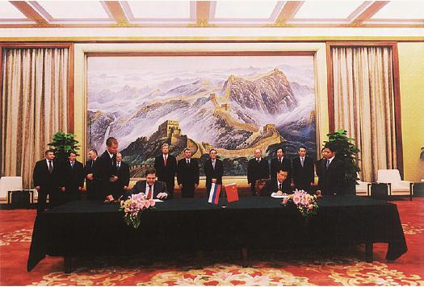

# 
 筚路蓝缕：世纪工程决策建设记述

### 
 中俄原油管道十五年谈判

#### 为什么要建设中俄原油管道

中国曾是个贫油国家，解放前使用的汽油、柴油几乎全要靠进口，所以叫“洋油”。20世纪50年代末、60年代初中国发现和开发了大庆油田，1963年实现了石油自给，其后并有少量出口换汇。但随着中国经济发展和人民生活水平提高，石油需求迅速增加，原油自给只维持了30年。到了1993年，原油进出相抵又成了原油净进口国，并且逐年增加。2016年，中国进口原油3.8亿吨，自产两亿吨，原油的对外依存度已经超过了60%。

20世纪90年代，大庆油田开采逐渐从自喷、抽采到注水，并且注水开采比重越来越大，又发展出三次开采技术，注入有洗涤功能的化学剂，将石油从岩缝中洗出。石油部门意识到大庆油田逐渐从盛产期开始进入衰退期。而大庆油田已经成为我国主要炼油厂的原油来源，大庆原油通过铺设到吉林、辽宁等地的原油管道向这些地区的炼油厂供应原油。随着大庆油田的减产，这些炼油厂的原料供应将出现问题。所以，石油部门从20世纪90年代就开始与俄罗斯方面接触，探索从俄罗斯西伯利亚的油田建设到大庆的管道，以弥补大庆原油产量下降造成的供应不足。

#### 最初以私营的俄罗斯尤科斯石油公司为合作伙伴

最初的考虑是从俄罗斯的萨哈、恰扬金等油田建设管道到大庆，但是与俄罗斯的谈判十分艰难，始终没有实质性进展。

1994年，中石油与俄罗斯民营石油企业尤科斯公司接触。苏联解体后出现了许多私营企业，其中较大的是这个尤科斯石油公司，它的总裁霍多尔科夫斯基是莫斯科伏龙芝区共青团的副书记，苏联解体后他“下海”成立了公司和银行，其属下机构在私有化浪潮中收购了尤科斯石油公司的股份，并逐步持有了尤科斯90%的股份，该公司采用股份制，其中募集资金中也有美国公民的股份。

尤科斯公司对与中石油合作建设中俄原油管道比俄罗斯国家石油公司积极。

尤科斯公司提出了“安大线”方案——从俄罗斯的安加尔斯克油田铺设原油管道到大庆，简称“安大线”。“安大线”西起俄罗斯伊尔库茨克州的安加尔斯克油田，向南进入布里亚特共和国，绕过贝加尔湖后一路向东，经过赤塔州进入中国，直达大庆。这个方案很符合中石油的想法，所以一直以俄罗斯尤科斯公司为主要谈判对手。

1996年，中俄双方企业完成了“安大线”的项目预可行性研究，但是直到1999年我任国家发展和计划委员会副主任时仍未能谈出结果。2001年9月，中石油和尤科斯公司及俄罗斯管道运输公司签署了关于开展“安大线”项目可行性研究的总协议，但是俄罗斯联邦政府似乎与尤科斯公司想法并不一致，项目没有实质性进展。

#### 中方同意用支付田湾核电站14亿美元现汇换取俄方同意建设中俄原油管道

我任国家发展和计划委员会副主任后分管能源、原材料工业，开始直接介入进口俄罗斯原油和建设原油管道的谈判。有一次，中石油总经理马富才从俄罗斯谈判回来，向国务院总理朱镕基报告了一个信息说：俄方提出，如果能把俄罗斯向江苏连云港田湾核电站提供设备的14亿美元易货贸易资金改成以现汇付给俄罗斯，俄方将同意建设中俄原油管道。

田湾核电站采用俄罗斯技术和设备建设。当时苏联解体，俄罗斯经济困难，急于出口核电这样的重大装备，于是与中国谈成了一个易货贸易的买卖，即中方不付现汇买设备，俄方向中方提供14亿美元的设备贷款，中方以纺织品、轻工业品、家电等出口物资偿还，这对中方颇具吸引力。到朱镕基任总理的20世纪90年代末期，我国外汇储备状况已经大为改观，不再在意支付这14亿美元现汇了。

朱镕基总理听了马富才同志的这一信息后，决定答应俄方意见，将田湾核电站的14亿美元易货贸易以现汇形式支付给俄方，以换取俄方答应建设中俄原油管道，并派我率团赴俄罗斯谈判落实。我即赴俄，住进中国驻俄罗斯大使馆，以不公开的形式与俄罗斯的各有关部门商谈。俄方派一名财政部的女司长陪同我们。我先后走访了俄罗斯经济发展部、财政部等部门，但感觉俄方态度并不像马富才同志传递的信息那样。俄方对中方支付田湾核电站外汇以换取俄方答应建设中国原油管道一事莫衷一是，推诿敷衍，这次出访没有取得什么进展，此事也就告吹了。我估计马富才同志的这一信息是从尤科斯公司那里听来的，或许是尤科斯公司给出的一个主意。

#### “安大线”与“安纳线”之争

之后，俄罗斯国内反对“安大线”方案的舆论越来越多，主要的反对理由是“安大线”经过贝加尔湖南端。贝加尔湖是世界上最大的淡水湖，号称占全球陆地淡水的1/5，是俄罗斯重要的自然保护区。俄罗斯担心石油管道一旦出现事故会污染贝加尔湖。另外，反对“安大线”的理由还有，俄罗斯应追求国家利益最大化，“安大线”只是将管道建到中国，向中国出口石油，应该考虑面向日本、韩国等亚洲国家的管道方案。

于是，“安纳线”的方案浮出水面。据说，“安纳线”的方案是由日本提出的。线路走向从伊尔库茨克州安加尔斯克油田出发，沿着贝加尔—阿穆尔大铁路和中俄边境地区，通往俄罗斯远东港口纳霍德卡。“安纳线”全程都在俄境内，而不是只通往中国。俄罗斯可以从太平洋岸边的纳霍德卡港将石油输往东亚其他国家。

日本也是一个需要进口石油的国家，也谋求进口来源的多元化，降低对中东石油的过度依赖，对俄罗斯只建通往中国大庆的原油管道心里是很不舒服的。2002年底，日本方面开始积极游说俄铺设“安纳线”。2003年上半年，日本首相小泉纯一郎两次与俄罗斯总统普京会晤，专门讨论能源合作问题。6月，时任日本外相川口顺子和前首相森喜朗访问俄远东地区，允诺为俄西伯利亚油田开发和管道建设提供75亿美元贷款，条件就是俄铺设“安纳线”。日本还想通过与俄能源合作，提高日本在远东地区的影响力，影响中俄全面战略协作伙伴关系，说白了就是要搅黄“安大线”。

由于日本的介入，俄内部开始重新讨论和确定中俄原油管道的线路走向。在按什么线路建设俄罗斯远东原油管道问题上，中日之间展开了暗中角力。

#### 普京最终拍板“泰纳线”，但悬念又出现

2003年5月，正当中国国内“非典”疫情肆虐的时候，胡锦涛主席开始了他作为国家元首的首次出访，参加俄罗斯圣彼得堡建市300周年纪念活动和出席上合组织第三次元首会晤，我陪同出访。访俄期间，胡锦涛主席亲自做普京总统的工作，发表了上合组织莫斯科宣言，中俄全面战略协作伙伴关系更加巩固，有力地促进了俄罗斯下决心建设中俄原油管道工程。

经过两年多的论战和博弈，2004年12月31日，由普京总统亲自拍板建设东西伯利亚—太平洋石油管道，即“泰纳线”方案，将“安大线”走向向北推了400多公里，远离了贝加尔湖，解决了俄罗斯国内长期争论的贝加尔湖环保问题。“泰纳线”东起伊尔库茨克州泰舍特，从贝加尔湖北面400多公里处经过，然后沿着贝加尔—阿穆尔大铁路，从斯科沃罗季诺开始沿着中俄边境地区延伸，最后到达太平洋港口纳霍德卡。

“泰纳线”分两期建设。一期工程首先铺设泰舍特—斯科沃罗季诺区段石油管道，设计年输油量为3000万吨，在纳霍德卡同时建设大型石油储存装置。斯科沃罗季诺位于中国黑龙江省漠河黑龙江对岸，管道由俄罗斯一侧黑龙江边的腾达穿越黑龙江，再由中方建设从漠河到大庆的管道。二期工程包括铺设斯科沃罗季诺—纳霍德卡石油管道，这一段的年输送能力为5000万吨，并将泰舍特—斯科沃罗季诺这段石油管道的年输油能力扩大为8000万吨。俄联邦政府颁布第1731号令，2005年4月26日，俄罗斯工业和能源部颁布91号令，批准建设“泰纳线”。

最后决定管道线路走向的背景是中俄全面战略协作伙伴关系更加巩固，互信关系增强。俄罗斯方面意识到中国对建设中俄原油管道的强烈愿望。事实上，中俄原油管道已经成了对中俄全面战略协作伙伴关系和两国互信的考验，同时也是俄国内政治、经济、社会因素和俄能源外交、维护俄国家利益最大化的考量，也体现了俄罗斯向东亚各国出口原油的能源外贸战略姿态。但是此时俄罗斯并未明确建设到中国大庆的管道，或者称之为“泰纳线”的支线。俄方甚至有人说，中国需要原油可以从纳霍德卡港进口嘛！中俄原油管道的建设还只是走完了万里长征的第一步，艰难的谈判和利益博弈还在后面。

现在回想起来，俄罗斯联邦政府对中俄原油管道迟迟不作决定与最初中石油选择尤科斯公司为合作方有关。尤科斯公司总裁霍多尔科夫斯基，在苏联解体私有化过程中“下海”办了尤科斯公司，政治上与当局不和，还有政治野心。2004年俄罗斯联邦政府以偷税漏税为名开始调查尤科斯公司，霍多尔科夫斯基进了监狱。

胡锦涛主席访问俄罗斯时，曾让我和马富才到他下榻的总统饭店汇报与俄方谈判中俄原油管道的情况。我们过去时，胡锦涛主席和夫人刘永清正在吃晚饭，还给了我一块烤红薯，我拿在手里没有敢吃。马富才同志汇报强调中俄原油管道至今谈不成的原因主要是日本从中搅局。我记得胡锦涛主席听后说了一句，你们不要光从外面找原因，还应该从俄罗斯内部找找原因，但是当时我们没有领会。马富才和霍多尔科夫斯基第二天还举行了记者招待会，俄罗斯联邦政府只来了一个外交部副部长，可见政府态度不积极。

#### 60亿美元贷款换石油方案，赢得输油支线中国优先地位

俄联邦政府以偷税漏税罪逮捕霍多尔科夫斯基后，在2004年12月19日公开拍卖尤科斯公司的下属子公司尤甘斯克油气公司76.79%股份，用以解决尤科斯的税务问题。贝加尔金融集团以93亿美元左右等值卢布竞价胜出。此后，俄罗斯石油公司又通过收购贝加尔金融集团全部股份，成为尤甘斯克公司76.79%股份的所有者。而尤科斯公司的美国股东在美国起诉俄罗斯联邦政府侵吞私有财产。俄罗斯石油公司为筹集资金向中国方面提出了贷款换石油的合作方案，希望从中国贷款60亿美元，俄方以销售石油款偿还。此前，中国的银行从未向外国企业一次性贷款如此大的金额。同时，苏联解体后俄罗斯经济下滑，中国国内舆论普遍对俄罗斯经济不看好，对俄罗斯的信用也持怀疑态度，向俄罗斯石油公司一次性贷款60亿美元在中国金融界很难得到支持。

时任国家发改委主任马凯召开会议协调各部门意见。只有马凯和我态度明确，主张给俄罗斯石油公司提供这笔贷款。我们认为中国需要购买俄罗斯的石油，而且从俄罗斯的进口量还在逐年增多，只要这笔贷款与中国购买俄罗斯石油挂钩，贷款的风险是可控的，应该抓住这个机会，扩大对俄能源合作，打破建设中俄原油管道的僵局。当时由陈元同志任行长的国家开发银行一向秉持按国家产业政策支持国家经济建设的贷款方针，陈元同志提出开发性金融的贷款思路。因此，国家开发银行表示只要国务院作出决策，国家开发银行愿意做这笔贷款的主贷银行。

国家发改委将协调情况和我们的意见上报国务院后得到国务院领导的支持，时任国务院副秘书长尤权同志发挥了积极的协调作用。他说服各部门作出了同意向俄罗斯石油公司发放60亿美元贷款，并与购买俄罗斯石油挂钩的贷款换石油方案，具体由中石油和国家开发银行与俄罗斯相应部门进行商务谈判。

2005年1月8日，中石油与俄罗斯石油公司签署《关于进口4840万吨俄罗斯原油的长期贸易合同》。根据合同，俄罗斯方面将在2005年至2010年通过铁路向中国供油4840万吨，并从中方获得贷款60亿美元，以原油贸易获得的收益偿还贷款。国家开发银行也与俄方达成了贷款的商务条件，以国际Libor利率加300点的商业贷款利率。这个贷款利率是不低的，完全是按照商业原则进行，贷款期6年。设立一个专门的银行账户，中国向俄罗斯购油的购油款存入这个账户，从这个账户向国家开发银行按期偿还贷款利率和本金。中石油向俄罗斯石油购油的价格也完全按照国际油价，以布伦特、西得克萨斯、迪拜等国际油价按一定公式计算出来。在执行中，由于Libor利率提高，再加300点后已经超出了当时国际商业贷款的利率。应俄方要求，国家开发银行降低了一次加的点数，大概降为Libor加200多基本点，大致与国际商业贷款差不多的水平。后来有的媒体对中国购买俄罗斯石油的价格和贷款利率的妄加猜测都是不实之词。到2011年，俄方还清了全部60亿美元贷款和利息，中国也购买了4840万吨石油，真正实现了双赢。国家开发银行也以这笔贷款为发端，开始了国际金融业务，并且成为国家开发银行的一项重要业务。

后来俄罗斯石油公司谋求上市，要寻找战略合作伙伴。中石油、中石化当时上市时也是这么做的。BP、壳牌公司成了中石油、中石化的战略投资者，买了中石油、中石化10%的股份，但后来他们趁中石油、中石化股价好时抛售了，据说仅此赚的钱相当于他们此前在中国的投资。为此，两大石油公司非常恼火，认为他们“不够意思”，但是他们回应这是企业商业行为，无可指责。俄罗斯石油公司寻找战略投资者首先想到了中石油。马凯同志和我主张应趁此机会，争取在俄罗斯石油公司中多占些股份，这正是我们过去一直争取的。但是中石油更多地从当时的商业利益考虑，认为俄石油股价估高了。后来时任中石油副总经理周吉平向马凯和我报告，说买了俄罗斯石油公司5亿美元的战略投资者股票，俄罗斯石油公司很感谢我们。我当时听了就很不高兴，当着马凯同志面就说中石油，印度还买了10亿美元，我们的确应该是俄罗斯石油公司的战略合作伙伴，而且我们过去一直想拥有俄罗斯石油公司的上游资产，现在不正是机会吗？为什么我们买的还没有印度多？而中石油的解释是股价估高了。但俄罗斯石油公司上市后正值国际油价高涨，股价是上涨的。正是人算不如天算也。

这其中还有一个插曲——对俄油气合作一直是由中石油一家与俄罗斯洽谈，我们担心如果中石化等其他公司参与进来，中国国内企业间的恶性竞争会被俄方利用，对我们与俄罗斯的谈判不利，所以政府也认可只由中石油一家与俄方谈判，约束其他公司不要掺和。和中石油同为“三桶油”之一的中石化在对俄石油合作中不甘被边缘化，私下也买了俄石油的两亿美元股票。此外，中石化也与俄石油在私下进行接触，商议出由俄罗斯经由蒙古国，到北京燕山的又一条管道。但是这不符合最初我们想从俄罗斯进口原油弥补大庆油田产量下降的初衷，因此担心这一方案会搅黄已经在推进中的到大庆的管道方案。由国务院副总理曾培炎同志告知中石化董事长李毅中，希望中石化停止与俄罗斯谈判经蒙古国的管道，中石化于是退了出来。但是中石化还是通过铁路运输，经蒙古国到燕山石化进口了一部分俄罗斯石油。

贷款换石油的合作，促使俄方在建设通往中国的支线原油管道问题上态度趋于积极。2005年7月8日，普京总统在苏格兰举行的记者招待会上首次表示，俄罗斯将在建设远东原油管道时优先铺设通往中国的输油支线。9月7日，俄媒体报道，普京总统在克里姆林宫接见西方记者时说：“东西伯利亚—太平洋管线一期工程将修至中国境内城市大庆，俄罗斯的石油首先输送到中国大庆，大庆支线的建成是第一位的，但最终会把管道修到纳霍德卡。”自此确定了中国优先的原则。

2006年3月21日，普京总统访华，能源合作是中俄合作的一项重要内容，双方在能源领域签署了一系列重要文件，能源合作也进入了务实合作的新阶段。签署的文件包括中石油与俄罗斯管道运输公司的会谈纪要，纪要的核心内容是俄方将完成俄境内斯科沃罗季诺至中国边境段原油管道建设的项目建议书和投资论证，并提交俄联邦政府有关部门进行审查。在此之后，双方企业开始了紧锣密鼓的工作，包括完成从斯科沃罗季诺至中国边境段的踏勘、讨论黑龙江穿越方案等。

俄方对建设通往中国的原油管道态度趋于积极，但仍不明朗。尽管普京总统多次提出要建设到中国的支线管道，但俄联邦政府从未在两国政府正式签署的文件中明确中国支线管道的建设问题，中俄原油管道仍然扑朔迷离。

#### 艰苦的马拉松式谈判——俄方不断提出附加条件

与俄方的谈判非常艰难，政府间协议由我和俄罗斯能源部副部长雅诺夫斯基主谈。雅诺夫斯基是位专家型领导，他认真细致而且有耐心，我对他的专业精神非常钦佩。但是“两国交兵，各为其主”，在谈判桌上他字斟句酌，锱铢必较，加上语言上的障碍，有时一个条款谈数个小时也是常有的事。

俄方对我们十分在意中俄原油管道建设非常清楚，他们在谈判中谋求本国利益最大化，常常将我方关切的中俄原油管道与俄罗斯关切的其他项目挂钩。例如：他们在协议文本中希望写进田湾核电站的三、四号机组仍采用俄罗斯原子能公司的技术设备；他们不能只是向中国出口原油，要求在天津投资炼油厂和加油站；要求写进中国每年从俄罗斯进口1500万吨煤炭；希望中方扩大进口俄罗斯电力；等等。此外，由于中俄之间长期存在的隔阂，双方都有戒心，对协议内容都非常小心，为哪句话在前、哪个条款在前也争论不休。文本除中俄两国文字以外，还必须在英、法语中选择一种文字作为副本。对争议时的仲裁法院和依据法律双方也有分歧。因此，我和雅诺夫斯基的谈判有时连续谈一天一夜，几十个小时。

2007年3月，胡锦涛主席再次访俄，出席俄罗斯中国年活动，在与普京总统会晤中，中俄之间的能源合作是绕不开的话题。因此，我和中石油的有关人士提前去莫斯科打前站，希望在高访中能签下两国间政府协议。我和雅诺夫斯基又是一场一天一夜的马拉松式谈判。我吃下安眠药准备睡上一觉，这时候胡锦涛主席到达总统饭店，立即叫当时的秘书陈世炬听取我们打前站的谈判情况。第二天早上醒来，我发现我房间的沙发上睡了一个人。我都是一人一个房间，哪儿来的人？原来是我的秘书付超奇。他说昨晚在陈世炬那里开会汇报时，我就睡着了，是他和国家发改委外事司司长马欣把我架回房间的。当时谈判的艰辛可见一斑。

#### 普京改任总理后，中俄原油管道合作未受影响

中俄原油管道的各项工作在各个层面继续往前推动。俄管道运输公司完成斯科沃罗季诺至中国边境段投资论证工作并提交审批后，2007年4月26日，俄工程建设审查管理总局批准了该段管道建设的投资论证。在此基础上，2007年6月中石油与俄管道运输公司又签署了《关于开展验收斯科沃罗季诺到中国边境段原油管道工程设计的纪要》。在2007年7月举行的第九次中俄能源合作委员会期间，我和时任俄罗斯能源部部长什马特科共同希望两国企业就签署中俄原油管道建设政府间协议进行协商，并尽快向两国政府提出建议。此后，中方向俄方提交了协议文本草案。2008年5月，梅德韦杰夫就任俄罗斯总统，普京就任俄罗斯联邦政府总理。2008年7月，俄管道运输公司完成斯科沃罗季诺至中国边境原油管道的工程设计并提交俄联邦政府审批，推动管道建设的各项准备工作在工作层面朝着目标有条不紊地进行着。

在另一条轨道上，签署2010年后新的中俄长期原油贸易合同的谈判也在进行中，供油方式由管道输送原油代替之前的铁路运输。谈判的难点问题是价格。俄方谈判人员表示，双方能否就未来长期合同价格达成一致是俄联邦政府下决心建设中俄原油管道的重要前提。经过艰苦谈判，双方逐渐就长期贸易合同的数量（1000万—1500万吨/年）、供油开始时间（2011年1月1日）和期限（10—20年）达成共识。

2008年8月18日，我主持召开会议，讨论中俄油气合作进展情况。当时中俄双方企业仍未就定价原则和公式达成一致，但商定要尽快完成合同谈判，以争取在10月底前签署长期原油贸易合同。但9月22日，中石油与俄石油高层领导会见时仍未能达成一致。分歧的焦点是俄方坚持以太平洋港口纳霍德卡的石油价格为向中国的售价，俄方希望将来纳霍德卡油价能成为继布伦特、西得克萨斯、迪拜后的又一个国际油价标准。而中方要求向中国出口的油价应该是纳霍德卡油价减去斯科沃罗季诺到纳霍德卡的管道运输费用。

#### 中俄副总理级能源谈判机制设立

在国家层面上，中俄两国领导人对能源合作高度关注和重视。2008年5月，两国元首倡议成立副总理级能源谈判机制。7月26日，国务院副总理王岐山和俄罗斯副总理谢钦在北京启动中俄能源谈判机制，并举行首次会晤。能源谈判代表机制采取非定期会晤方式，根据合作进展的需要由一方或双方代表提议召开。

2008年10月底，国务院总理温家宝访问俄罗斯并与俄罗斯总理普京举行中俄总理第13次定期会晤。两国高层领导的会晤照例又是一次推动两国能源合作的好机会。为此，在温家宝总理到访之前，中俄能源合作分委会（分别由我和俄罗斯能源部部长什马特科牵头）和新设立的副总理级能源谈判机制相继在莫斯科召开，为温家宝总理访问俄罗斯做好准备。

2008年10月23日上午，我与俄罗斯能源部部长什马特科共同主持召开中俄能源合作分委会第10次会议。分委会的焦点议题是中俄原油管道。在此前磋商分委会纪要文本时，中方希望在政府层面明确建设中俄原油管道，提出在此次两国总理会晤期间签署政府间文件，但俄方只同意由企业继续完成管道建设的工程设计和俄罗斯联邦政府审批等工作。

#### 敲定原油定价公式

在会场外的另一个谈判场，中石油与俄石油就长期原油贸易的合同价格机制终于达成一致，解决了制约建设中俄原油管道的关键问题。俄方向中国出口原油价格为纳霍德卡油价减去斯科沃罗季诺到纳霍德卡的运费。给出的价格公式是P=N–T，T是多少仍未确定，中方要求减去10美元/桶，这个要价肯定是期望值太大，俄方是绝对不会答应的，中石油也知道不可能，只是作为最初讨价还价的要价。而俄罗斯能源部部长什马特科后来与我交涉要求T为零，我当然不能答应。我回应，T如为零，为什么当初双方谈成的价格公式中有减去T的部分？这个悬案就一直留了下来。直到后来王岐山副总理与谢钦副总理磋商，T的值逐渐靠拢，最终达成了一致。

#### 文本草签仪式上，中俄谈判人员相拥而泣

但是两国政府间的协议仍然处于胶着状态，俄方态度仍不可捉摸，他们好像还在等待着什么。

2008年10月24日，俄方未安排继续谈判。雅诺夫斯基副部长说今天没什么事，问我愿不愿意参观俄罗斯石油公司总部，我想今天没什么事，就答应了。到了俄罗斯石油公司总部，他们告诉我今天来得正巧，俄罗斯副总理谢钦、能源部部长什马特科及俄罗斯石油公司、俄罗斯管道公司、俄罗斯天然气公司等五大能源巨头正巧也在俄罗斯石油公司研究工作，问我愿不愿意见见。我当然愿意。就以这种“巧遇”方式，我在俄石油总部会见了俄罗斯副总理谢钦。

谢钦副总理非常热情，他在会客室对我说，中国需要石油，俄罗斯有石油，也愿意向中国出口石油，但是自他担任俄罗斯分管能源的副总理后认真审视了俄罗斯向中国出口原油的方案，认为现有俄罗斯的石油生产能力不能保证连续20年每年向中国出口1500万吨原油，必须开发新的油田和建设输油管道。他立即叫人拿来了地图，铺在地板上指给我看俄罗斯现有油田分布和探明储量的情况。他指着泰舍特附近一处说，必须开发这个新的油田，同时管道经过沼泽地，建设难度很大，需要大量投资，而俄罗斯没有那么多资金投入。他提出，如果中方能提供150亿美元贷款，俄方才能建设中俄原油管道，管道输油量1500万吨/年。2007年起美国次贷危机引发全球性金融危机，油价暴跌，卢布贬值，俄企业确实面临资金短缺的困难。我表示这一情况我必须向国内汇报。从俄罗斯石油公司回来后我立即通过使馆向国内报告。中方内部紧急组织研究，当天由国务院副秘书长尤权开会协调各方面意见。

我们一行被安排在莫斯科附近的外交公寓，自己生壁炉取暖，我表面欣赏伏尔加河的秋景，心中却非常焦急，因为我知道国内的办事程序，有些方面机构林立，意见往往莫衷一是而贻误战机，这就要看协调人的能力和领导的决心了。可喜的是，莫斯科时间凌晨3点多，中方代表团接到国内反馈，同意提供贷款，前提是敲定中俄原油管道的建设。我的心才落了地，感谢国内的重视，强有力而及时的协调。我再无睡意，索性起床独自一人到伏尔加河边散步，直看到朝霞映红了整个河面。天亮后，我立即请陪同我的驻俄使馆经济参赞裴建胜通知俄方，举行了文本的草签仪式。长期从事中俄原油管道谈判的工作人员也抑制不住心中的激动，俄罗斯能源部的一个老头抱起了中方的年轻翻译曹伟，相拥而泣。

#### 俄方又将贷款额增加到250亿美元

2008年10月26日，王岐山副总理在国务院副秘书长毕井泉陪同下到达莫斯科，与谢钦副总理进行中俄能源谈判代表会晤。

我去机场迎接王岐山副总理时还出了一个差错。大使馆裴建胜参赞安排车辆和确定出发时间，我担心莫斯科交通拥堵，要求提前出发，而裴建胜认为时间完全充裕，结果被堵在路上进不得退不得。王岐山副总理乘坐的飞机已经降落在机场，而我还在路上。我灵机一动，下车翻过附近一个过街天桥，截了一辆出租车，向回程方向赶回宾馆，赶在王岐山副总理到达宾馆前在宾馆门口迎接他。

第二天王岐山副总理与谢钦副总理的会晤中，俄方将贷款数额提高至250亿美元。中方研究后表示同意，要求两国能源主管部门具体落实。

#### 昼夜鏖战，银行的意见让我恼火

2008年10月27日下午，我即与俄罗斯能源部副部长雅诺夫斯基商谈中俄两国关于中俄原油管道、提供贷款等事项的政府间文件。会谈在俄总统饭店进行，气氛非常友好，但在具体的文本表述上双方严谨细致、据理力争。

在谈到28日凌晨4点时，文本才基本达成一致，双方主谈人一直紧绷的神经也才放松下来。雅诺夫斯基邀我到大厅喝点什么，让工作人员整理打印文件。凌晨4点，大厅酒吧无工作人员，雅诺夫斯基点起一根烟的时候，我从来不抽烟，也高兴地向他要了一支，这是一种细长的烟，像是女性抽的，我们还开起了美国能源部部长博德曼的玩笑。雅诺夫斯基一高兴，对我说，我们还可以在文本最后加上一句话，双方还可以探讨俄罗斯向中国每年出口3000万吨原油的可能性。我一听很高兴，同意加上，我认为这是一个额外收获，没想到这句话惹了麻烦。

一切就绪后，雅诺夫斯基回家睡觉了。6点钟毕井泉副秘书长要了我和雅诺夫斯基敲定的协议草案，征求代表团中其他部门同志的意见。代表团中一位银行的领导认为加进去的最后一句话不妥，他认为俄罗斯承诺每年向中国出口1500万吨原油是和中方向俄方提供250亿美元贷款挂钩的，现在写上俄罗斯向中国出口3000万吨的可能性，是否俄方隐含将来要求中方再提供250亿美元贷款？所以银行要求删掉最后一句话。但此时我已经找不到雅诺夫斯基，他已经回家睡觉了，我只好拜托裴建胜参赞设法找到雅诺夫斯基去掉加上去的这句话。我也很生气，我们银行的人就是这样的思维，所以我也不客气地说，你们买美国那么多债券经过哪个部门讨论了？更何况协议文本中并未出现俄方要求中方再贷250亿美元的内容！

#### 俄方临时变卦，会见被推迟3小时

2008年10月28日，国务院总理温家宝到莫斯科与普京举行中俄总理第13次定期会晤。当日，我和什马特科代表两国政府签署《关于在石油领域合作的谅解备忘录》，中石油与俄管道运输公司签署了《关于建设和运营斯科沃罗季诺至中国边境原油管道的原则协议》。在这次温家宝总理访俄期间，中俄双方基本敲定要建设中俄原油管道，离签署最终具有法律约束力的协议只有一步之遥了。

接下来近4个月的时间，双方政府、企业、金融机构围绕合同细节、利率等问题又进行了多轮艰苦谈判。2009年2月17日举行中俄能源谈判代表第三次会晤，相关文件要在会晤时签署，因此在会晤前双方企业和金融机构进行了通宵的谈判谈定了文本。

2009年2月17日上午在北京人民大会堂由王岐山副总理和谢钦副总理率领双方团队举行中俄能源谈判代表会晤。上午谈得很好，一切顺利，王岐山副总理宴请谢钦副总理，计划在宴请后举行签约仪式，签约后温家宝总理在中南海会见谢钦副总理一行。但就在宴会席间，俄管道运输公司总裁托卡列夫突然向俄罗斯能源部部长什马特科汇报合同文本中有几处无法与中方达成一致，关键是俄石油公司和俄管道公司要求贷款要分别贷、分别还，形成各自的协议文本，而不同意共同签在一个文件中，如果不改合同签不了。

俄方经常在最后关头生变，我已经不是第一次遇到了，不知这是不是俄方的谈判策略。后来在布拉戈维申斯克谈天津炼油厂项目时也是这样，一切都谈妥了，俄方安排在黑龙江上游船吃晚饭。只待上岸后就签，但就在游船上俄方突然提出他们不能保证向天津炼油厂提供原油，要求在协议文本中修改这一条款。我很奇怪俄方为什么要这样改，买俄罗斯原油不是俄方的愿望吗？否则天津炼油厂与俄罗斯合资有什么意思？就为这一条款双方人员一直耗到后半夜，双方无关的其他企业人员都困了、不耐烦了。俄方带头玩起了“赌博游戏”，押赌今晚能否签约，几点能签约，猜得最接近者赢。和俄罗斯俄铝谈远东瓦尼诺港合资时也是同样的情况，上午谈好了合资文本，下午签约仪式时俄方突然提出要减少中方股比，我气愤地离席而去。

在向王岐山副总理汇报这一突发情况后，他说：“没达成一致意见继续谈，我们等着。”随后，中俄双方能源部部长、中石油和俄管道运输公司的领导相继离席去进行磋商。

俄罗斯谢钦副总理和俄罗斯大使把我拉到一边，拼命解释，要求中方接受俄方意见，把本来一份协议拆成两份。这倒也没有什么，但要说服中石油和国家开发银行。国家开发银行会不会担心俄罗斯管道公司如何保证还款能力，需要在条款中有新的约定。这些都需要时间。我向王岐山副总理报告后，他很沉着，决定耐心地等，让双方工作层抓紧修改文本。这样一等就是3小时，我怕领导着急，急得像热锅上的蚂蚁。由于之前没有预料到要举行谈判，因此出现了双方企业领导和人员站着谈判的有趣现象，俄罗斯副总理谢钦、俄罗斯大使和我，加上一个翻译就站在电梯旁边谈。在协商解决双方分歧后，等待企业准备文本时，谢钦一改以往严肃形象，面带笑容、心情放松，甚至还主动和中方工作人员合影留念。终于在5点多，比原定时间推迟了3个多小时后，才在人民大会堂举行了隆重的签约仪式，我和俄罗斯能源部部长什马特科代表两国政府签订了政府协定。同时，一揽子签署了250亿美元融资贷款合同、中俄原油管道建设和运营合同以及长期原油贸易合同（从2011年1月1日起，在未来20年内俄罗斯每年通过管道向中国供应1500万吨原油）。

 

 中俄原油管道在人民大会堂签约。张国宝（右）和俄罗斯能源部部长什马特科（左）代表两国政府签字

王岐山副总理和谢钦副总理见证，15年谈判终于一锤定音了。温家宝总理在中南海的会见也推迟了3个小时，领导人都表现出极大耐心，也让我十分敬佩。

当天，感慨之余我写了一首《菩萨蛮》词纪念这一天的艰苦谈判。

 菩萨蛮·庆中俄原油管道签约

 十五载跌宕博弈，

 一昼夜鏖战斗智。

 安大多诡谲，

 泰纳藏玄机。

 政经相交织，

 外交暗角力。

 首脑亲运筹，

 远东布新局。

两国政府签署的关于石油领域的合作协议、贷款协议、管道建设及原油贸易合同，于2009年4月21日开始正式生效。

2009年6月，国家主席胡锦涛再次对俄罗斯进行国事访问，6月17日在与梅德韦杰夫总统会谈时再次强调：“全面落实中俄石油领域合作政府间协议，为两国开展长期全面稳定的能源合作奠定坚实基础，积极推进可再生能源、新能源等领域合作，形成两国全方位、综合性能源合作格局。”中俄之间在原油管道取得突破后，互信关系加强，迅速向天然气、煤炭、电力、可再生能源等其他能源领域合作发展。会见后进行签字仪式，我和什马特科部长签署了中俄天然气合作和煤炭合作的谅解备忘录。

#### 中俄双方签署能源合作与地区合作文件

2009年，国家副主席习近平率团访问了俄罗斯远东地区和莫斯科、圣彼得堡，我和陈元同志等全程陪同。访问中，习近平副主席继续做俄罗斯领导人工作，发展和巩固中俄能源合作成果。在国家副主席习近平和国务委员刘延东见证下，由我和俄罗斯原子能工业公司总裁基里延科（俄罗斯原总理）、地区发展部部长签署了能源合作和地区合作的文件。

中俄原油管道建设问题虽然尘埃落定，但是国际政治经济博弈是复杂的。俄罗斯在决定建设通往大庆的石油管道之时，也没有忘了安抚日本，决定在萨哈林岛与日本合资建设一个年产700万吨的LNG工厂，向日本供应液化天然气。日本首相亲自到萨哈林岛出席开工仪式，日本方面也得到了心理平衡。

#### 我开玩笑批评裴建胜参赞不要“一仆二主”

工程开工前，围绕双方义务和责任的施工协议谈判仍然龃龉不断。

中方的主谈人是中石油俄罗斯公司总经理蒋奇，他是中国驻俄罗斯大使馆前任经济参赞。而在莫斯科由中国驻俄罗斯大使馆时任经济参赞裴建胜与俄方交涉。

按商定，管道穿越黑龙江的施工由中方负责，中方施工队伍要经常到对岸俄罗斯一侧，如果每次施工队伍过去都算出国，要办理出入境手续那就太麻烦了。中方要求俄方在岸边划出一个施工区，中方施工人员到这个施工区作业视同在国内，无需办理出入境手续，相当于俄方边防、口岸后退到施工区之后。俄方答应了。说句实话，如果此事在中国，很可能办不成，这不是涉及领土主权问题吗？接下来是中方施工设备到对岸施工区不应算出口设备到俄罗斯，俄方不能征收进口关税。俄方同意除烟酒和私人汽车都可以不缴关税。中方又提出中方在对岸施工人员不缴纳俄方税收，俄方也同意。说实在的，这都是律师搞出来的名堂，其实第一个问题解决后，后面问题也都解决了，但律师提出的这些“严谨”问题把事情越搞越复杂。最后律师还提出中方雇用的外国人也不缴个人所得税，俄方不同意了。谈判陷于胶着，问题反映到我这里。

裴建胜参赞对谈判的进展和问题随时向我报告磋商，但因为他是国家发改委从中石油借聘的（裴建胜俄语好，本科清华大学毕业，莫斯科国立管理大学博士），他在国内的组织关系还在中石油，所以每次他先报告中石油，并主要按中石油意见与俄方交涉。中方要求雇的外国人免缴个人所得税问题出来后，我也火了。我说怎么又出来外国人？他说万一以后我们雇外国监理或技术人员呢？我说那应该根据该外国雇员国籍与俄罗斯是否有避免双重征税协定执行。中俄原油管道前后谈判15年，来之不易，不要因未来未必发生的假设耽误时间了。我以开玩笑的口吻批评裴建胜，你不要“一仆二主”，现在你是国家发改委派出的人，这个问题你要听我的，如果将来确要雇用外国人，应按该雇员国籍所在国与俄罗斯的税务协定执行。

这样最后问题才算解决了。

#### 驱车回首萧瑟路，龙江潮涌起宏图

2009年4月27日，中俄原油管道俄罗斯境内段开工建设。5月18日，中俄原油管道中国境内段在漠河县兴安镇开工建设。国务院副秘书长毕井泉、我以及有关部委和中石油代表陪同王岐山副总理到漠河现场参加开工典礼。我们在机场下机后还乘了一段火车，再坐很长一段汽车，翻过一个山岭。这个季节就像《北国之春》歌曲唱的，白桦刚露出嫰芽，但翻越山岗时却飘起了很大的雪，翻过山岭后天空豁然开朗，艳阳高照，向黑龙江畔开工现场驶去时，茫茫林海上空风起云动，霞光从云层中露出，担心开工时下雨的心情终于放下。

苏轼《定风波》词中有“回首向来萧瑟处，归去，也无风雨也无晴”。想到中俄原油管道15年谈判的坎坷，犹如一路风雨的萧瑟之路，终于在黑龙江边迎来开工的艳阳天。中俄能源合作正在展现宏图，象征着中俄能源合作迎来了一个新的时期。我抑制不住兴奋，写了一首《蝶恋花》词：

 蝶恋花·喜庆中俄原油管道开工

 兴安松柏吐翠绿，

 北国春韵，

 层峦万木苏，

 杜鹃争艳密林处，

 忽有骤雨雪花舞。

 林海葱茏更娇妩，

 极目北陲，

 云海霞光露。

 驱车回首萧瑟路，

 龙江潮涌起宏图。

#### 普京自驾拉达车出席竣工仪式，亲自启动中俄原油管道阀门

2010年9月底，管道建成投产试运行，俄罗斯在漠河对岸的斯科沃罗季诺举行隆重的竣工投产仪式。我应邀率中国代表团参加投产仪式，中石油副总经理汪东进出席。我们先到达黑河对岸的布拉戈维申斯克，我和俄罗斯能源部部长什马特科主持举行了中俄能源合作分委会会议，然后由俄方飞机接我们去斯科沃罗季诺。俄罗斯副总理谢钦已经先期到达，他约我到路口，说马上有一个人来。一会儿见有一辆拉达汽车开过来，原来是普京自己开着车来了。普京亲自启动了阀门，象征着俄罗斯原油已经注入中俄原油管道输往中国。在隆重的大会上我代表中国政府讲话祝贺。

 

 中俄原油管道建成通油，普京出席在斯科沃罗季诺的建成通油仪式，张国宝代表中国政府讲话

#### 中俄原油管道的重要意义

作为我国油气进口东北方向的一条战略要道，中俄原油管道起点为俄罗斯东西伯利亚—太平洋原油管道斯科沃罗季诺分输站，在腾达穿越黑龙江，到达漠河，途经黑龙江省和内蒙古自治区13个县市区，终点为中国漠河—大庆原油管道漠河首站。管道在俄境内段长约63.4公里，黑龙江穿越段长1.5公里，我国境内从漠河至大庆段长965公里，一期工程设计输油量为1500万吨/年。

遵照双方的约定，2011年1月1日正式投产进油。管道建成后运营顺利，中俄原油贸易规模也不断扩大，截至2017年5月，中国自俄罗斯经中俄原油管道进口原油突破了1亿吨。据海关数据统计，2015年俄罗斯成为中国第一大原油进口来源国，当年从俄进口原油4243万吨，2016年中国从俄进口原油5248万吨，再创历史新高。

为了巩固中俄友谊，我们提议向在中俄原油管道决策和建设中发挥重要作用的谢钦副总理，能源部部长什马特科、副部长雅诺夫斯基，俄罗斯石油公司和俄罗斯管道公司总裁等10人授予友谊勋章，在温家宝总理访问俄罗斯时隆重举行了颁发仪式。其后，俄方也对等授予了中方10人友谊勋章。

值得欣慰的是，双方在2013年3月又商定要增加供应原油至3000万吨/年。为此，中方启动建设漠河—大庆复线（从斯科沃罗季诺到漠河段设计规模即可达3000万吨/年），在2017年底前建成投产，届时通过中俄原油管道每年即可进口原油3000万吨，成为中国长期稳定的原油进口来源。

2016年中国进口原油3.8亿吨，只有中俄、中哈、中缅三条陆上管道，而中缅管道仍是转运从海上来的中东原油，所以真正陆上来的只有中俄、中哈两条管道，管道进口量仅占全部原油进口量的10%左右，其余全部要从海上运输，中俄原油管道的战略意义可见一斑。

中俄原油管道前后谈判了15年，其间政经交错，最后能得以实现，起决定性作用的是两国领导人高瞻远瞩，他们亲自领导了中俄能源合作，确定了中俄全面战略协作伙伴关系。数万各部门、各级工作人员，石油战线的干部、技术人员、工人为此付出了辛勤的劳动，在回首这一过程时深深地向他们致敬。