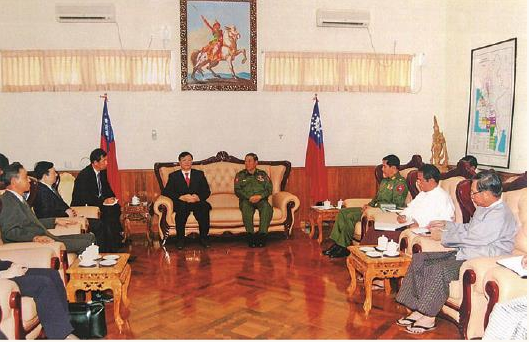

# 
 筚路蓝缕：世纪工程决策建设记述

### 
 中缅油气管道十年磨一剑

2017年4月10日下午，在中国国家主席习近平和缅甸总统吴廷觉的共同见证下，中缅代表双方在北京签署《中缅原油管道运输协议》。同日晚间，油轮在印度洋畔的缅甸马德岛卸油进入中缅原油管道，经12年筹备建设，中缅原油管道工程正式投运。

从此，除来自东北的中俄石油管道、西北的中哈石油管道及来自东部的海上通道外，又多了一条来自西南的石油运输通道，我国原油进口多元渠道形成，能源运输安全得到进一步保障。

#### 为什么要建中缅油气管道

建设中缅油气管道在2004年就开始酝酿。2004年10月14日，我主持会议，要求中石化拿出中缅原油管道前期研究报告，同时要求中石油同步开展研究。因为当时中石油已经承担中亚天然气管道和中俄油气管道的任务，我想应该让中石化也承担一项任务。

2005年1月7日，中石油调中国石油管道公司张加林到中国石油规划总院任党委书记、副院长，专门负责中缅原油管道前期研究工作。2005年4月，国家发展改革委派出能源局负责油气工作的副局长张玉清为团长，组团赴缅甸考察中缅原油管道的可行性。回来后，听取了中石油、中石化、中海油各自编写的研究报告。

2005年7月4日，缅甸能源部部长伦迪准将应我邀请访华，并分别代表两国签署了《中缅关于加强能源领域合作的框架协议》，其中，第五条“双方同意适时就启动中缅输油管道前期研究开展进一步磋商”。

 

 2005年7月4日，张国宝与缅甸能源部部长伦迪会谈

2005年9月28日，缅甸能源部部长建议，“中国在考虑原油管道的同时最好能一并考虑开展天然气管道问题”。2006年6月19日，国家发改委给国务院报告“国家发改委关于开展中缅油气管道有关工作的请示”，报告说：“实施中缅原油、天然气管道，尽管存在各种困难因素，但从长远看，具有战略意义。建议由我委组织有关企业和地方政府，深入开展前期工作，尽快提出实施方案，报国务院审批。建议由中石油承担相关工作。中石油、中石化均做了大量前期工作，由于该项目政治上较敏感，建议由一家公司承担为宜，以减少内耗，提高工作效率，同时，考虑到该项目沿线地形复杂，技术要求高，投资数额大，中石油资金、技术、生产管理经验等具有优势，如国务院同意，即责成该项工作由中石油承担。”

国务院批准同意了该报告。2006年8月14日，国家发改委给中石油集团发文，转发了国务院的批准报告。

徐荣凯同志任云南省长期间，云南省多次向中央建议修建中缅油气管道。2006年，胡锦涛总书记考察云南，徐荣凯省长当面向胡锦涛总书记建议建设中缅油气管道，并讲了抗战时期史迪威油管的历史。由于在缅北有民地武分治问题，当时重点讨论了油管的安全问题。后来秦光荣省长在中共中央党校学习时，把建设中缅油气管道作为他的毕业论文。中缅油气管道的意义并不主要是像有的媒体报道的那样为了运输安全绕开马六甲海峡，而主要在于我国西南部四川、重庆、云南、贵州、西藏广大地区没有原油供应和炼油厂，所需油品全靠兰成渝管道和沿长江逆流而上，这一问题在汶川地震救灾中较为突出。

当时兰成渝管道受唐家山堰塞湖威胁，堰塞湖一旦决口，水流冲下来就会冲垮附近的兰成渝管道，使四川的燃油中断，10万救灾部队及机械设备的燃油就成问题。所以由解放军工兵部队对绵阳附近桥梁管道做了加固。当时我在国务院抗震救灾前线指挥部工作，专门给中石油领导去电，让他确保兰成渝输油管道不出问题。另外，抗日战争中，缅甸作为美国向中国战场运输战争物资的通道，建设了以史迪威将军名字命名的著名战时公路，动员了几千名东南亚华侨驾驶汽车运送物资，牺牲者众。但燃油是通过从印度的加尔各答建的一条经缅甸的史迪威管道，知道的人却不多，这条管道的残骸现陈列在腾冲的博物馆。所以，经缅甸向中国西南部运油是有历史的，是一条从印度洋通往中国西南部的运输通道。同时，我们经过仔细计算，原油从马六甲海峡到达我国南部港口，再用管道输往昆明、成渝地区，运输成本比从马德岛上岸，通过中缅管道到昆明要高。

#### 中缅合资建设

2013年11月6日，中缅天然气管道试运行。玉溪成为中国首批用上缅甸天然气的城市。

2008年，我任国家能源局局长后率团访问缅甸，缅方由能源部副部长吴丹田准将陪同，乘飞机飞到了马德岛上空，俯瞰马德岛和皎漂港。从空中看马德岛受多岛环绕，是天然避风良港。后来由天津一家设计院设计，经勘测航道平均水深20米，可以通行30万吨油轮。中缅之间关于建设油气管道的协商，时任驻缅甸大使管木做了大量工作。后来管木大使调往泰国任大使。

2009年3月26日，中共中央政治局常委李长春访缅。在李长春和缅甸第一国务秘书丁昂敏乌见证下，我代表中国政府与缅甸能源部部长伦迪就建设中缅油气管道磋商，签订了《关于建设中缅原油和天然气管道的政府协议》等一系列能源合作备忘录和协议。

2009年12月20日，国家副主席习近平访问缅甸，推动中缅油气管道建设。我作为随行人员与缅甸能源部进行谈判，当时驻缅大使是叶大波。与缅甸第一国务秘书丁昂敏乌会谈时，习近平谈道，中缅油气管道是中缅合作的标志性工程，希望缅方能予推动，加快上马，早日建成。但由于时间短促未能全部谈妥，习近平同志指示我留下继续与缅甸政府磋商。

中缅油气管道的设计是同时并行建设天然气和原油管道，都从缅甸西部的印度洋港口起步。天然气管道从皎漂港开始，原油管道起自马德岛，然后并行建设，均从云南瑞丽进入中国。

天然气来源是由韩国大宇等天然气管道外方公司在缅甸印度洋大陆架若开盆地A1、A3海上气田共同开发的，已探明年产量50亿立方米，当时韩国大宇正在寻找销售市场。同时我们也与缅甸谈了几个海上区块进行风险勘探，中石化在陆上也有风险勘探区块。政府间谈判也是我去谈的，并签订了政府间协议，但后来这些区块是否获得了有商业开采价值的储量，我就不知道了。原油则来自中东和非洲地区。

原油和天然气管道均采取中缅合资方式。原油管道设计年输油能力2200万吨，中方占50.9%，缅方占49.1%。天然气管道股比：中方50.9%、缅方7.365%、韩国大宇国际25.041%、印度OVL 8.347%、印度GAIL 4.1735%、韩国燃气4.1735%。

2010年6月3日，国务院总理温家宝访问缅甸，中缅两国总理共同宣布中缅油气管道正式开工建设。工程在缅甸米坦格河河畔的管道施工现场开工建设。

2010年6月3日，国家发改委下发《国家发展改革委关于中缅天然气管道（缅甸境内段）项目核准的批复》：经国务院同意，现批复如下：为增加我国天然气供应，改善西南地区能源消费结构，促进沿线地区经济发展，同意你公司（中石油——作者注）建设中缅天然气管道（缅甸境内段项目）。

2010年6月22日，国家发改委下发《国家发展改革委关于中缅原油管道（缅甸境内段）项目核准的批复》：为保障我国石油供应安全，开辟新的陆上原油进口通道，推动西南地区经济发展，同意你公司（中石油——作者注）建设中缅原油管道（缅甸境内段项目）。

#### 十年磨一剑

其间，随着缅甸国内政局变化，中缅油气管道工程波澜起伏。先是缅甸军政府以陆上风险勘探区块内有重要军事工程为由，取消陆上勘探区块。后来缅甸国内一部分人受国内外敌对势力蛊惑，说中国拿走了缅甸的能源。其实这条管道的油源来自中东，根本不是从缅甸生产的能源，运来的油还要给缅甸供200万吨，是帮助缅甸增加了能源供应，管道采取中缅合资方式，也给缅甸带来收入。

后来缅甸政局发生变化，丹瑞大将的军政府权力移交给民选政府，原能源部部长伦迪将军转为国会议员，但他仍积极推动油气管道建设，打电话给我担心中方施工拖期，我向他保证中方绝不会拖延工期。后来中石油缅甸项目负责人张加林因年龄退休，我曾努力想让中石油同意延长张加林的退休年龄，但未能如愿。

为了防止因缅北民地武问题影响管道建设，我曾到缅北军区与缅北军区司令会晤，希望双方都保证管道顺利建设。

2013年5月28日，中缅天然气管道缅甸段总算建成了。2013年7月28日实现了向中国供气，云南、贵州终于用上了天然气，但是目前累计输送才40亿立方米，远未达到设计年输气120亿立方米的能力。原因可能是缅甸国内产量尚未上来，中国境内管网也未完善。

石油管道却停滞了两年。2014年5月30日，石油管道施工完成。2014年10月30日，马德岛码头完工。

在习近平同志担任中共中央总书记和国家主席后，积极维护周边和平外交政策。2016年6月，缅甸资政昂山素季访华，习近平主席和李克强总理与昂山素季会谈中都谈到了要稳妥推进中缅油气管道合作。中缅两国的友好睦邻关系得以巩固，最终达成了原油管道的运输协议，前后历时12年，真正是十年磨一剑。

现在马德岛已经成为一个现代化的石油港口，我们所有参与过此项工作的人都感到欣慰。