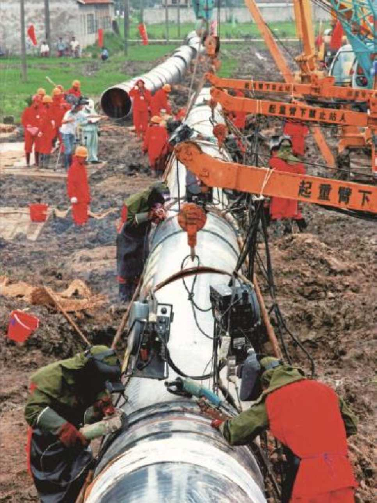

# 
 筚路蓝缕：世纪工程决策建设记述

### 
 西气东输工程意义重大 [^1]

[^1]: 本文是张国宝为《西气东输工程志》所作序的主要部分

跨入21世纪，一条西起新疆塔里木气田，东至上海黄浦江畔，途经10省区市近4000公里管道干线铸成了气贯神州的能源大动脉，在祖国辽阔版图上由西向东画上浓墨重彩的一笔，源源不断地将天然气输送到长江三角洲、珠江三角洲等中东部地区。塔里木沙漠的天然气穿越万水千山，化为长江两岸和粤港广大地区的万家灯火。

西气东输工程自1998年开始酝酿，2000年决策立项，2002年7月正式开工，2004年10月1日全线建成投产、12月30日全线商业运营，比计划提前一年，建设速度之快令世界瞩目。作为一项庞大的系统工程，西气东输从决策酝酿到战略实施，从气源落实到市场开发，从试验示范到技术攻关，从工程建设到材料装备，从开工建设到商业供气，每一个环节都彰显了社会主义制度能够集中力量办大事的优越性，都得到了党中央、国务院的坚强领导，得到了国家有关部委、沿线各省区市党委政府及各族人民群众的大力支持。

在工程建设中，需要多次穿越河流、公路、铁道，普查清理文物。面对戈壁、荒漠、高原、江河等多种地形地貌和多种气候环境变化，又遭遇了“非典”疫情暴发等前所未有的困难和挑战，沿线各地区、各参建单位、数万名建设者、成千上万家材料设备供应商在国家西气东输工程建设领导小组统一协调下，精心组织、科学施工、顽强拼搏、团结协作，创新应用了诸多先进工艺和先进技术，开展了700多项技术攻关，填补了30多项国内技术空白，在管道施工技术、施工装备以及钢材、钢管的国产化等方面取得了一系列重大突破，解决了长江盾构、黄河顶管穿越等世界级技术难题。

 西气东输工程管道建设现场

西气东输工程创造了我国管道建设史上诸多第一：第一次采用10兆帕高压输送、全自动焊接、全自动超声波检测等新技术；第一次采用内涂层减阻、干空气干燥等新工艺；第一次在长江和黄河完成长距离、高难度、大口径盾构、顶管及定向钻穿越；第一次在天然气管道上推广应用卫星遥感选线技术和先进的自动化控制系统，使我国管道建设技术和科技含量整体达到世界先进水平。

西气东输工程创建了一整套工程项目管理模式和运行机制，按市场经济规律实行项目法人责任制、面向国内外施工企业和设备材料供应商的招投标制、合同管理制、引入国际团队的监理制、异体监督制度，实施全过程质量控制体系、全员安全生产责任制和“给戈壁多留点绿地、给动植物一片蓝天”的绿色计划，建成了一条达到国际标准的安全优质管道；培育形成以艰苦奋斗、顾全大局、与时俱进、实事求是为主要内涵的西气东输精神，涌现出一大批可歌可泣的先进模范人物和先进集体，谱写了一曲社会主义大协作大团结的光辉篇章，展现了我国工人阶级队伍的过硬作风和良好风貌。

由于西气东输工程的建成使我国引进中亚天然气成为可能。在胡锦涛主席亲自推动下，横跨土库曼斯坦、乌兹别克斯坦、哈萨克斯坦和中国的中亚天然气管道，与西气东输管道相连，来自中亚的天然气输送到包括香港在内的广大地区，惠及4亿人口。这对于调整我国能源结构，缓解中东部地区能源紧张的矛盾，改善大气环境质量，提高人民生活水平，推动沿线各地经济社会发展具有极其重要的意义。

我国以西气东输为发端，进一步完善天然气发展规划，即将建成二期工程，三期工程开工建设，中亚天然气管道开始建设C线，统筹考虑中西部、海上和陆上资源，来自西部的管道气和沿海进口LNG相结合，加快储气库、增压站和相关支线建设，一个分布全国的天然气管网开始形成。西气东输工程无疑在西部大开发和天然气管道建设史上矗立起一座丰碑。

西气东输的天然气有约1/3用于燃机调峰发电。而当时我国大型燃气轮机制造尚处于空白，以此为契机我们开展了燃气轮机打捆招标，以市场换技术，使我国发电设备制造企业迈进了大型燃气轮机制造的门槛。经过联合攻关，钢铁工业不仅填补了不能生产X70、X80型钢管的空白，X100型也已研制成功。西气东输的天然气替代了燃油、燃煤的工业窑炉，沿线陶瓷行业面貌一新，质量提高。最近我们针对西气东输尚不能国产化的燃压机组、电驱压缩机组、大口径球阀等关键设备，组织沈阳鼓风机集团公司、中船哈尔滨703所、哈尔滨汽轮机厂等企业开展国产化攻关，电驱压缩机组已在高陵压气站成功运行。40英寸球阀已大批应用于工程中，促使机械工业水平上了一个台阶。西气东输工程的实施可谓是“一石三鸟”，带动效应持续发酵。

《西气东输工程志》全面客观记述了工程建设历程，系统总结工程建设成就和宝贵经验，真实反映了数万名建设者风餐露宿、艰苦奋战的精神面貌。我有幸作为西气东输工程建设的一名组织者、参与者与见证者捧读此志，与广大工程建设者一样，心潮澎湃，思绪万千，回望八千里路云和月，管道穿越罗布泊边缘时管道工人头顶烈日、面迎风沙、汗流如注的场景，黄河顶管时沉井被洪峰围困的险情，长江盾构遇到砾石层工程受阻的焦急，工程建设的一幕幕情景、一幅幅画面徐徐浮现。

西气东输工程的决策和实施也给我们留下了许多值得深思的精神财富。重大工程的规划建设需要胆略和战略眼光，要有对历史负责的责任感，要有“世上无难事，只要肯登攀”的气概。朱镕基总理的拍板决策和推动是工程得以实施的关键。
