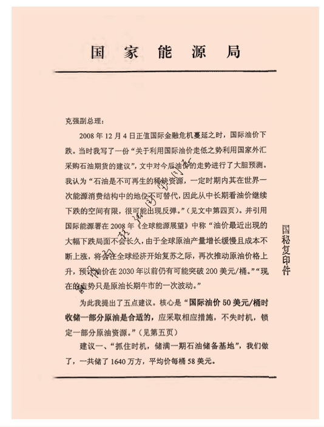
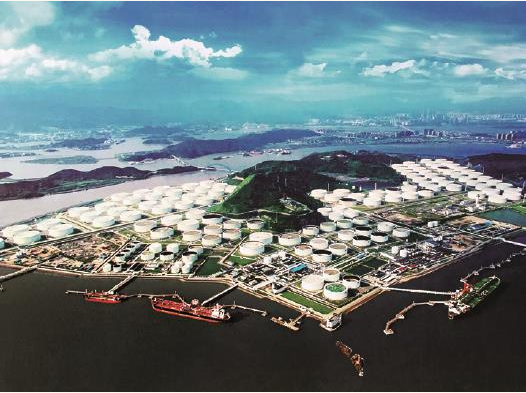

# 
 筚路蓝缕：世纪工程决策建设记述

### 
 国家战略石油储备的起步和发展

2015年，国际油价一路下行。2016年1月下旬，美国西得克萨斯轻质原油（WTI）期货价格已经跌破30美元/桶，跌幅超过60%。现在国际油价徘徊在50美元/桶左右，仍然处于低迷状态。同时，2016年我国进口原油3.8亿吨，达到创纪录水平，增长13.56%。面对国际油价大幅下跌，大家都认为，我国此前在高油价时期着手建立战略石油储备基地是一个非常英明及时的决策。储备基地建好后，正好赶上油价下跌逢低吸储，大大降低了石油储备收储成本，为我国未来经济发展提供了有力的能源保障。作为这一决策的亲历者，回顾这一过程，我深深感到当时作出这一决策非常正确、及时，其过程伴随着反复论证比选和攻坚克难、积累经验，并不那么简单和容易。这一决策过程，充分体现了中国能源工作者为确保国家能源安全的强烈责任心以及他们所付出的锲而不舍的努力。

国际上，战略石油储备诞生于战后第一次石油危机，在第二次石油危机期间得到加强，在之后的历次石油价格暴涨暴跌中不断成熟和完善。1973年至1974年的第一次石油危机期间，欧佩克组织（OPEC）通过控制产量，使原油价格从每桶3美元上升至11美元，沉重打击了严重依赖石油进口的西方经济，使西方发达国家意识到石油供应是其经济的软肋。于是，1974年，经合组织（OECD）国家联手成立了国际能源署（International Energy Agency，IEA），要求成员国至少要储备60天进口量的石油，以应对石油危机，被称为应急石油储备。石油储备包括政府储备和企业储备两种形式，在必要的时候成员国之间应该互相提供储备支持。其中的政府储备也被称为战略石油储备。20世纪80年代以伊朗革命为主要诱因的第二次石油危机期间，油价从每桶13美元上升至43美元，进一步凸显了石油依赖经济体面对油价危机的脆弱性。于是国际能源署进一步要求成员国必须把石油储备增加到90天净进口量以上。石油储备制度逐步完善，规模进一步扩大。从那时起到现在已经过去了30多年，每当国际石油供应存在风险时，国际能源署成员国都动用石油储备。例如，美国政府在1991年海湾战争期间以直接销售的方式向市场投放了3300万桶储备原油。美国也曾请求中国，作为同样的石油进口国，在释放原油储备，平抑国际油价方面与美国协调一致。

西方国家通过应急石油储备，一是有效地削弱了石油生产国以石油为武器对西方国家的威慑，使人为的供应冲击不至于发生或频繁发生；二是在真正发生供应危机时，也通过释放原油储备，平抑危机风险，将石油供应冲击的影响降到最小，确保了自身经济和政治稳定。可以说，应急石油储备已成为西方国家重要和有效的能源保护措施和经济武器。

20世纪80年代西方国家刚建立应急石油储备时，我国也有一些密切关注国际形势的同志提出应该建立中国的战略石油储备。但由于那时中国石油供大于求，是一个石油出口国，国家层面对石油供应的短缺或中断的危机感并不强烈。那时也很难去预料中国未来的石油需求会快速大幅度增长，会成为石油净进口国，对外依存度会达到60%以上，成为世界上最大的石油进口国之一。所以这个提议并没有引起特别重视、付诸实施。

1993年是我国能源供需变化的重大分水岭。由于经济的快速发展，原油进口急剧增加，这一年我国由原油净出口国转变为原油净进口国，结束了大庆油田发现以来，自1963年起实现石油自给并略有盈余出口的30年历史。此后，原油进口量不断跨上新台阶。2004年首次突破1亿吨大关，2009年突破2亿吨，2014年突破3亿吨。2015年我国石油对外依存度已达60.6%，2016年更进一步升高到65.4%。正是在这种急剧变化的能源发展格局下，建立我国战略石油储备的必要性和迫切性日益凸显，研究界和决策层逐步统一了思想。

随着我国石油消费和进口数量的逐年增加，党中央、国务院从我国现代化建设的全局和维护国家能源安全的高度出发，对建立国家战略石油储备、保障国家能源和经济安全问题多次作出重要指示。1996年3月17日，第八届全国人民代表大会第四次会议批准的《中华人民共和国国民经济和社会发展“九五”计划和2010年远景目标纲要》，提出“加强石油储备”。2000年11月，在中央经济工作会议上，江泽民总书记明确要求，对建立国家战略石油储备等关系全局的项目要抓紧论证，尽早实施。2002年3月20日，国家计委向国务院报送了《关于增加原油储备设施建设的几点情况》。朱镕基总理在该报告上批示：“请计委进一步论证后，报总理办公会审定。”2002年底国务院总理办公会听取并审议批准了《国家计委关于建立国家石油储备实施方案的请示》，标志着我国正式启动国家石油储备基地建设。习近平总书记一直关注和重视石油储备工作。在2005年12月26日和2015年5月25日分别以中共浙江省委书记和中共中央总书记的身份视察了舟山国家石油储备基地。

建设战略石油储备被提上了日程。但是具体在哪个地方建，该采取何种管理模式，是建地面油库还是建地下储备库，这些问题看似非常具体细微，但是如果不能解决好，将极大影响建设进程和工作效率。这些决策都经历了非常详细的论证研究。

#### 首先，在哪个地方开始建设？

当国家筹备建设战略石油储备的消息传出去后，各地都非常积极，认为这是拉动本地经济的一个重要机会，能刺激本地石化产业发展。但是由于我国幅员辽阔，各地经济发展水平和现有石化生产能力均不相同，再加上这是一项全新的工作，必须先试点，积累经验后，再全面铺开。为此，我们邀请中国国际工程咨询公司组织专家对国家石油储备基地工程的选址及其他建设条件、项目投资、安全生产设施等进行了评估，提出了“建立国家石油储备基地应按照统一规划，合理布局，规范管理，循序渐进的原则，并充分依托和利用现有设施布点建设”。一期先解决有无的问题，尽快选择在东部沿海地区建设。主要是因为东部地区石油需求较大，现有炼油厂也比较多，石油储备能够就近服务炼油厂，同时东部沿海地区又有便于海运进口原油的有利条件。当时，我国进口原油除很少量从中哈以及中俄跨境铁路运输外，绝大部分是通过海上运输的。

最后选择了第一期4个储备项目，包括舟山岙山、宁波镇海、青岛黄岛及大连4个基地。这4个地方均是东部沿海地区，经济发达、需求旺盛，而且附近均有大型炼油厂。当时也确定了，接下来的第二期、第三期储备项目可以在西部适宜地区建设，以使布局更为合理，更为安全。所以，后来西南、西北多地都非常积极地申请建设储备基地。二期工程安排了若干西部石油储备基地。

#### 第二，该采取何种管理体制？

美国的战略石油储备管理模式分两个层面。管理层面，由设在华盛顿特区的美国能源部战略石油储备办公室负责储备政策和规划；由设在新奥尔良的项目管理办公室负责具体项目的实施、运行管理。操作层面，采取市场化机制，由市场招标确定石油公司和基地管理公司，石油公司负责储备的采购和投放，基地管理公司负责储备基地的日常运行维护和安全保护。

 

 2009年张国宝考察新疆独山子石油储备基地选址。右四为新疆维吾尔自治区发展和改革委员会主任韩学琦。

当时国家发改委和财政部有部分同志建议部分仿照美国模式，在管理层面和美国相同，但在操作层面拟成立专门的基地管理机构负责基地管理以及所在基地原油的收储和投放。也就是说，石油储备办想一竿子插到底，基地的人财物、产供销统统归储备办管理，成为一个从上到下的管理体系。还有同志建议完全仿照美国模式。但是当时我认为，这两者都有不妥的地方。如果专门成立基地管理机构并且招聘人马，那么国家又得支付这些机构人员的各种开支，给储备工作增加额外的成本负担，而且由于当时人才、资源都集中在少数大型国有石油石化企业，一时也招聘不到这么多熟悉石油储存、采购、销售的工作人员，必然影响储备工作的效率。在北京的办公室看似有权，遥控指挥基地的工作，但不能有效抓住市场机遇，收储石油，一旦出现安全事故责任也很难界定。全盘照搬美国的模式，当时中国的国情也还不具备条件。美国的石油市场是完全市场化的，有大量的专业石油公司和服务公司，可以通过招标迅速确定石油公司和管理公司。但我国的石油市场并不具备美国的条件，短期内难以做到。

两种模式都有不足。我认为：美国模式在管理层面的设计是不错的，主要问题在于操作层面。为了节约运营成本，提高工作效率，应该采取美国模式，通过市场招标确定操作层面。但是中国的石油主要集中在三大油企，市场没有美国那么发达，大的炼油厂分属这三大油公司。换一个角度想，中国的市场格局是国企独大，国有企业的利益跟国家的利益应该是一致的，那么可以直接把基地管理运营和原油收储投放责任委托给基地附近的石油企业，这样不仅为国家节约了操作层面的各种成本，而且充分利用了国企的人才和资源优势，提高了工作效率。此外，这也让国企能借助管理石油储备，为企业自身的经营获取更多的信息、硬件和资金。因为石油储备的建设费用和运营经费都是由国家财政出资的，这样处理财政部也便于接受。我在有关会议上提出建立具有中国特色石油储备的三级管理模式，大家表示赞成。设立一个石油储备办归属国家能源局，属政府管理机构，负责顶层的储备政策和规划，代表政府决定收储规模和动用石油储备。由一个类似于美国项目管理办公室的机构作为中间层的事业单位，具体负责项目的实施、运行管理。操作层面则委托就近的国有企业负责承建和管理对口的石油储备基地并承担安全责任。原油储备投放根据石油储备办编制的国家计划由企业负责操作。

按照这一思路，2003年，原国家发改委能源局加挂了国家石油储备办公室的牌子。后来，随着机构改革调整到现在的国家能源局的储备办公室，作为石油储备体系的龙头。2007年12月18日，国家石油储备中心正式成立，作为国家发改委的事业单位。后来又调整成为国家能源局的事业单位，作为我国石油储备管理体系中的中间层，行使出资人权利，负责国家石油储备基地建设和管理，承担战略石油储备收储、轮换和动用任务，同时监测国内外石油市场的供求变化。操作层是国家出资，委托国有企业管理的储备基地公司。例如一期的4个基地，岙山基地委托中化公司管理，镇海、黄岛基地委托中石化的镇海石化公司和青岛炼油厂管理，大连基地委托中石油大连炼油厂管理。这样省去了人员额外配置，也加重了企业的日常运营管理和安全责任。

#### 第三，建地上油库还是建地下储备库？

由于美国在墨西哥湾附近的路易斯安那州和得克萨斯州境内集中分布着大量盐穹，靠近石油化工产业带，所以美国的战略石油储备库大多是地下盐穴储油库。这种洞库建设非常容易，将水打入盐穹溶解岩盐，然后将卤水抽出，地下就会产生体积巨大而且封闭性良好的洞穴，建设成本和维护成本都非常低。不具备这种自然条件的国家，只能采取建设地面大型油罐的方式。另外还有地下水封岩洞库，是指在地下水位以下的岩体中人工挖掘形成一定形状和容积的洞室储存石油，具有占地少，维护成本低，安全可靠等优点。之所以要在地下水位以下，是为了使缝隙中的水压高于洞内的油压，防止石油外泄。我国不少地区具备建设地下水封岩洞库的地质条件。

对于采取何种方式，当时也有争论。有的同志认为，战略石油储备关系国家能源安全，应该模仿美国模式建设地下储备库，最大限度地保障储备安全。但中国东部没有像美国地质条件的地下盐穹，建设洞库只能直接在地下开凿洞穴，担心建设成本将远远超过在地面建设储罐。在成本和安全之间难于平衡。在开展西气东输工程时，为了寻找地下储气库的地方，我们推荐过江苏金坛等有地下岩盐的地方，但溶盐形成盐穴的过程缓慢。为此我们多次开会讨论。我们综合分析了影响储备安全的主要影响因素：战争因素和恐怖袭击因素。这些都是各国普遍要面对的问题，并非中国一国特有的问题，也不能因此就不建地上油库了。今后的储备库应是地上油库与地下储备库相结合的方式。

一期工程我们先解决有无的问题。大家也觉得很有道理。所以一期的4个基地，全部都采用地上储罐的方式。当然，考虑到我们曾经在烟台、汕头等地建设过液化石油气的地下水封岩洞库，为了积累地下储备库的经验，我们也考虑因地制宜，在地面空间有限以及地下地质结构较好的青岛黄岛等地规划建设大型地下水封岩洞库。而利用地下盐穹储油，由于现有的地下盐矿距离沿海较远，盐层厚度欠佳、卤水处理难解决等问题，而未能采纳。

这些问题解决后，2004年3月，国家发改委召开了国家石油储备基地一期项目建设启动会。在会上，我做了推进一期项目建设的动员报告，与几个集团公司领导签订了项目建设责任书。镇海基地第一个开工建设，拉开了我国建立国家石油储备的序幕。但一期项目建设并不是一帆风顺的。项目建设遇到了国内大型储罐高强度钢板的试制和供应问题，而进口钢板价格成倍上涨。为此，我决定组织有关部门进行大型储罐高强度钢板国产化攻关工作。在各方的共同努力下，上海宝钢集团、武钢集团等公司生产的高强度钢板相继通过国家容标委的认证和施工单位的工艺焊接实验，并在储备基地成功推广使用，打破了日本钢铁企业对我国高强度钢板市场的垄断，为国家节省了大量建设资金，并提高了国内钢铁企业制造水平和竞争力。经过项目建设者的共同努力，镇海、黄岛、大连和舟山基地分别于2006年9月、2007年12月、2008年11月和2008年12月建成并投入运行。

一期项目建成之日，正遇上2008年全球金融危机爆发，国际油价从150美元/桶下跌到50美元/桶。4个基地抓住时机，收储了大批廉价原油，并于2009年上半年注油完毕。当时平均收储成本仅约为56美元/桶，基地建设和原油收储大获成功。我还为此专门写了一篇报告呈国务院领导。

根据一期项目建设的成功经验，我们组织着手编制了石油储备规划。2008年，国务院批准了《国家石油储备中长期规划》，计划到2020年完成三期战略石油储备基地建设。2009年开始，第二期储备基地启动，新建储备基地包括舟山（二期）、黄岛（二期）等。二期储备基地包括了西部地区和地下储备库，储备布局更加完善，储备方式趋于合理。国家石油储备基地建设进入了正常推进阶段。

#### 其间又发生了几件有关石油储备的事情。

2008年10月，我去舟山基地检查建设情况，中化公司负责原油期货业务的钟韧同志同往。钟韧同志是原油期货操作的行家，而且通过期货套期保值为中化公司获取了不菲的利润，曾被评为全国劳模。他在考察中介绍了原油期货，让我学到了很多套期保值的知识。有一天晚上饭后散步，我跟我的秘书聊天。我说：目前国际油价下跌，我们的储备库都快装满了，没办法再买油。为了抢抓油价下跌的机遇，现在完全可以通过购买期货锁定一部分廉价原油。即便是短期内期货价格还会下探，但长期来看肯定会再次上涨的。只要我们购买期货的目的不是投机，而是为了获取未来的原油实物，那么从长期看我们肯定是买到了便宜的原油。我判断现在油价处于低位，趁机购买期货应是合算的，即使出现价格波动，只要我们不是为了炒作，风险也是可控的。

2009年初春，我去检查大连石油储备基地建设情况。大连造船行业的同志对我说，由于国际金融危机，很多船东现金流紧张，无法缴纳造船费用，导致很多新船包括油轮押在船厂。当时有报道，欧洲有些国家利用闲置的油轮趁低收储原油。我当时想，不如把这些船东不要的半成品油轮先租过来，也不用加装动力和别的装置，直接把密封船壳拖到近海作为浮动的储油基地，正好解决现在储油能力不足的问题，一举多得。我当时把这个想法跟随行的国家石油储备中心的同志说了，大家都觉得是个好办法。后来，国家石油储备中心与中船重工集团合作，研究提出在船厂直接制造超大型油轮（VLCC）模块采取坐滩方式放置在硬基岩的滩涂上短期内建成大型石油储备库的方案。

在石油价格低迷时，我曾希望利用价格低迷的机会增加收储。当时大部分储备基地没有建成，也曾考虑利用社会民营油库，但民营油库规模小，而且所处的港口位置都不能停靠大型油轮，更主要是财政部不同意向民营油库支付租金，所以没有搞成。

我曾把这几个想法专门写了报告上报国务院。但可能由于事情的操作比较复杂，财政部有不同意见，尤其是期货操作让大家都还是心存疑虑，所以没能真正实施。现在回想起来非常遗憾。但是，我觉得这些想法可以作为未来开展多元化石油储备的思路。可喜的是，现在民营企业华信公司在海南洋浦建设了300万立方米的民营储备库，开创了民营企业参与收储的先河。建设过程中得到了海南省委罗保铭书记的大力支持，这个民间储备库没有报国家批，罗保铭书记出席了开工典礼。我在参观该储备库时鼓励他们大胆干。

由于我们的体制，石油储备经费是由财政部出资，每年收储多少，先由储备办提出计划，送财政部会签，财政部同意后与国家发改委共同上报国务院批准后才能实施。所以这一决策过程非常缓慢，往往错失了油价低迷时收储的最佳时机。有一次，油价跌到了40多美元/桶，我紧急召开会议，认为油价基本已经跌到谷底，应该抓紧收储，要求中石油、中石化和中化公司赶快行动，同时启动会签财政部上报国务院的程序。我知道国际油价瞬息万变，等批下来已经时过境迁。所以会上我说，大家回去后立即行动，不要等批复下来再行动，出了问题我负责。但是大家都不敢，中石油零星购买了一些，后来看还没有批文又卖掉了。

 

 2011年5月，张国宝就扩大原油储备等问题给李克强同志的建议信首页。

还有一件事，2010年7月16日，中石油大连商业储备库发生原油储罐着火事故，我正好到大连出差。因为事先不知道哪家油库出事，以为是大连储备基地。我迅速赶到大连新港，参加应急指挥部现场组织的灭火行动。后来才知道不是大连储备基地，是企业的商业储备库。事后一位随行人员问到我有没有上保险。受此启发，我想到国家储备石油的保险问题，回到北京后立即召开了会议。当时国家石油储备基地确实没有上保险，而且还发生过雷击。储备办和储备中心随即与财政部协商，在财政部的支持和领导下，国家石油储备中心从2011年起，通过招投标选择几家保险公司，对一期4个基地资产全部投了保险，并建设了防雷击装置。

当我国第一个大型地下水封岩洞库建成时我已经退休，我利用封库前的时机，深入到地下洞库中仔细进行了考察。地下水封岩洞储油在欧洲已经相当普遍，特别是在瑞典已有六七十年的历史，从军用到民用，他们也曾想向中国转让技术，后来因为我们自己已经掌握了技术，基本上可以自主建设。经过考察，我纠正了过去认为地下水封岩洞库造价贵的误解，其实建设成本比地上储油库还要低，且占地少，运营成本也低，只是建设周期较长。我国在水电、铁道建设方面有很强的隧道涵洞施工队伍，在有条件的地方应该争取多建地下水封岩洞库。我后来通过国家发改委的《经济情况与建议》对第一个大型地下水封岩洞库的情况向有关部门作了汇报，得到了总后勤部领导的批示和国家物资储备局的重视，也准备应用于成品油的储备。在后来的建设中规划了多个地下水封岩洞库建设，部分已经建成。

位于舟山群岛岙山岛的储备基地是唯一一个三大油企以外，由中化集团管理的基地，因为在岙山原来就有一个中化集团自己的企业储备库。岙山基地建成后蔚为壮观，中化集团组织退休干部去参观，这些老同志看到建设起来的每个十万立方米的大型储油罐，为祖国的建设成就激动不已。

习近平同志在任中共浙江省委书记时十分关心岙山石油储备基地建设，曾登岛视察基地。担任总书记后去浙江视察，他又专程视察了岙山基地，作出重要指示。一位中央领导视察岙山基地时，基地领导反映，岛上还有少量居民，希望国家出资把岛上居民全部迁走，整个岛都成为储备基地，这样更加安全。我接到该中央领导转来的意见后，协调国家发改委投资司拨款3亿元，把岙山岛全岛变成了储备基地。我看到建设起的连营成片的巨型白色储罐，心情也十分激动，填《西江月》词一首。

 **西江月·舟山岙山岛建成国家石油储备基地**

 华东输油管道起自岙山，经册子岛，穿过西堠门海峡航道,

 经金塘岛登陆，沿长江直到武汉。五年筹划建设，终成正果。

 海天佛国普陀，

 散落岛屿星罗。

 岙山惊现白营盘，

 筑起巨罐座座。

 观似连云樯橹，

 却是国储原油。

 海上管道穿西堠，

 直输苏皖湘鄂。

 

 浙江舟山岙山岛国家石油储备基地。

过去沿长江布局建设了许多石化厂，例如扬子石化，安庆、九江、武汉、岳阳等地石化厂，所需原油靠长航公司用轮船逆流而上运输。岙山基地和沿江管线建成后，这些沿江石化企业所需的原油主要改为用管道运输了，节省了运输成本，但问题是长航经营受到影响。为此我专门开会研究，批准长航开展远洋运输业务，并让中石化给长航一些成品油运输业务。

第一期国家石油储备基地建成恰逢2008年国际金融危机导致的油价下跌。当第二期国家石油储备基地陆续建成之际，又正好赶上了2015年世界经济放缓造成的油价下跌。中国的战略石油储备，无论是选址布局，还是运营模式和时机把握上，都积累了非常丰富和成功的经验。面对瞬息万变的国际经济和石油市场，只要我们不断学习国际经验，实事求是地结合我国国情，谦虚谨慎、开拓创新，就一定能够把握经济发展和国际油价变动的规律，建设好战略石油储备，为国家的经济建设提供坚实的能源保障。

