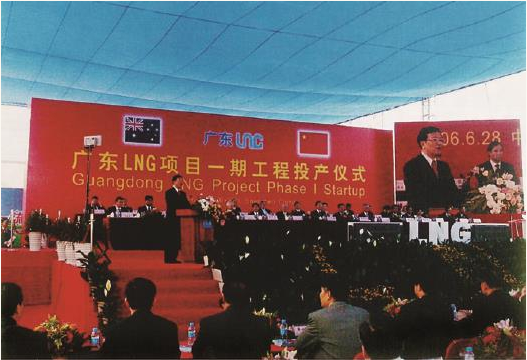

# 
 筚路蓝缕：世纪工程决策建设记述

### 
 中国天然气事业发展之路 [^1]

[^1]: 本文是2017年9月13日张国宝在国际天然气合作发展论坛上的主旨发言

#### 一、中国天然气事业发展的简单回顾

天然气在中国既是一种使用历史悠久的能源，也是一种大规模使用历史短暂的新能源。中国的四川盆地有天然气资源和地下盐矿。早在2000多年前就有记载，四川自贡一带用天然气煮盐卤水用于生产盐。有一本名为《天工开物》的书中有记载，并有用天然气生产盐的图画。但是直到40年前，中国实施改革开放政策的时候，天然气还只是少数地区的少数人知道的能源。那时，在中国的能源结构中，天然气微不足道，甚至可以忽略不计。

1997年，中国建设了第一条长距离天然气管线——陕京管线，长918公里，把天然气输送到北京。在海南岛的北部湾海域发现了海上天然气，建设了从海南岛北部湾的莺歌海到香港的管线，向香港每年供应20亿立方米天然气。在东海，原地质矿产部调查队（后来叫新星公司），在上海附近的东海平湖油气田也发现了少量天然气，每年可供上海4亿立方米天然气。那时候我已经在国家计划委员会工作，我记得陕京管线还分配给天津每年2亿立方米，西安每年1亿立方米的天然气，但天津还担心用不完。直到2003年，天然气在中国能源中的比重还只占2.3%，而那个时候世界上许多发达国家天然气在能源中的比重已经超过10%，有些国家甚至达到30%。例如，在美国、俄罗斯，天然气已经成为一种主要的清洁能源。那个时候，在中国，天然气主要用作城市居民的生活用气，也有少量用于生产化肥和发电。

2000年以后，中国政府开始谋划建设从新疆到上海的西气东输管线，全长4000多公里，设计规模每年120亿立方米。我们从来没有建设过这么长和这么大容量的输气管道，也曾经谋求与壳牌等外国公司合作，但是没有成功，最后只有靠我们自己来建设。那个时候，管线的材料X70钢，加压用的燃压机组我们都不会做，从钢铁厂研发生产X70钢开始一步一步摸索。我们也没有建设过大型的储气库。因为西气东输工程需要，才在江苏的金坛利用地下盐矿空穴建设第一个较大的储气库。但是西气东输工程只用了两三年就建成了，并且在靖边和陕京管线相连接，可以向北京、天津供应天然气。西气东输惠及了2亿多人口，其重要意义是开创了中国开始大规模使用天然气的时代。用朱镕基总理的话说，是在神州大地上画上了浓墨重彩的一笔。后来又建设了西气东输二期工程，将天然气从新疆送到广东、香港。

#### 二、中国天然气的对外合作

由于中国已发现的天然气储量不能满足迅速增长的市场需求，我们在2005年以后开始与俄罗斯、中亚各国商谈进口他们的天然气。在中国和中亚土库曼斯坦、乌兹别克斯坦、哈萨克斯坦四国元首的亲自推动下，于2009年建成了中国第一条从境外引入的长输天然气管道，叫中亚天然气管道，开创了中国进口境外天然气的历史，开始了天然气的国际合作，中国也成了天然气的净进口国。中亚天然气管道初期设计能力每年300亿立方米，现在已经建成了A、B、C三条管线，走的是同一条路由，与西气东输管道相连接。D线还正在建设中，管线走向与A、B、C线不同。中亚天然气管道进口天然气的合同数量也扩大到了每年680亿立方米。截至2016年，我国通过中亚天然气管道已经累计进口天然气1900多亿立方米。

后来我们又与缅甸合作，与中缅原油管道同期建成了中缅天然气管道。它的气源是韩国大宇公司在缅甸孟加拉湾海域勘探开发的海上天然气，生产量一年只有50亿立方米左右，卖给了中国。只是现在也还没有达到每年50亿立方米的设计能力。但是这条管道使中国偏僻的西南山区的云南省用上了天然气。现在我们还只有这两条陆上进口的天然气管道。俄罗斯的东线天然气管道正在建设中，预计2018年可以建成通气。

在本世纪初，我们谋划中亚天然气管道的同时，也开始了液化天然气（LNG）的事业。经过激烈的招标竞争，我们最初选择广东大亚湾和福建的LNG接收站进口澳大利亚和印度尼西亚的液化天然气，以后又扩大到上海进口马来西亚LNG。现在我们已经建成运营了11个LNG接收站，并且还在迅速增加。LNG的进口国也从澳大利亚、印度尼西亚、马来西亚，扩大到了卡塔尔、文莱。同样，我们从最初不会生产LNG运输船和LNG储罐的钢板，现在已经能向日本商船三井出口LNG运输船。短短不到20年时间，中国从一个天然气在能源中占比微不足道的国家成长为仅次于美国和俄罗斯的世界第三大天然气消费国。但是，目前中国仅占全世界天然气消费量的5.9%，而美国、俄罗斯占到全世界天然气消费量的33%。目前天然气在中国能源中的比例已经占6.3%，和发达国家相比差距还很大。但由于市场空间大，在中国，天然气比其他能源增长速度都快。即便在近几年能源需求相对疲软的情况下，天然气增长速度也仍然较快。今年上半年比去年同期增长了15.2%。进口天然气410亿立方米，本国生产743亿立方米，进口的依存度已经达到36.5%。中国天然气没有出口，但为了维持香港繁荣稳定，我们将西气东输管道通过海底管道延伸到了香港，每年向香港供应10亿立方米天然气。中国台湾商界对进口大陆的天然气也十分感兴趣，特别是毗邻大陆的金门县，我曾应邀去访问过。即便海底管道通到台湾岛，在工程上现在也可以做到。目前的障碍不是工程技术问题，主要还是两岸的政治关系问题。

 

 2006年6月28日，中国第一个LNG接收站——深圳大亚湾LNG接收站竣工投产。

#### 三、中国城市燃气事业迅速成长

中国的天然气事业从无到有，在辽阔的国土上已经将西气东输、陕京管线、川气出川、沿海天然气管道、中亚天然气管道、中缅管道初步连接成了一个全国性的天然气管道网络，并且与沿海星罗棋布的LNG接收站连为一体。这种建设速度在世界上是绝无仅有的。中亚通过里海到欧洲的纳布科管道，起初比我们的中亚天然气管道提出还要早，但是至今没有实质性进展。我们的天然气管网既有中央政府集中力量办大事的优越性，也有全国各省区市众多企业相互支持，体现了社会主义能集中力量办大事的优越性。目前骨干管道还是以央企为主在建设经营，他们资金雄厚，技术力量强，但是也有民营企业和外资企业参与。例如从晋东南山西端氏到河南博爱的煤层气管道就是由四川一个民营企业家建设的。新疆吉木乃到哈萨克斯坦斋桑气田是由民营企业广汇建设经营的。民营企业新奥燃气正在舟山建设LNG接收站。各省区市的支线管网既有地方政府所属国有企业，也有民营企业，也有混合所有制企业建设经营的。

在城市燃气事业中，民营企业、外资企业也扮演着重要角色。中国的城市燃气，五家企业经营最多，中石油的昆仑燃气（国有），香港的港华（外资）、华润（香港中资企业），民营的新奥燃气，中华燃气，这五家企业都经营着约一百多个城市的燃气业务。还有许多城市的燃气是由地方政府所属的城市燃气公司在经营。例如北京燃气，现在北京的天然气年消费量已经超过了160亿立方米，甚至超过了纽约市的用气量，成为仅次于莫斯科的世界第二大用气城市，这是我们始料未及的。俄罗斯东线天然气管道投入运营后，中国的天然气管网将进一步扩大到有1亿人口的东北，连接关内、关外的管网。中国的企业还积极投资于境外的天然气勘探开发。在澳大利亚的西北大陆架拥有1/8股份；在土库曼斯坦阿姆河右岸、俄罗斯亚马尔气田，都有中国的投资。中国已经成为世界天然气领域最活跃的国家之一。

#### 四、增加天然气在能源结构中的比重是治理大气污染的需要

在中国，包括北京在内的许多城市饱受雾霾肆虐之苦，政府正在下决心治理。造成雾霾的原因尽管争论很多，煤炭行业也有不同声音，但中国煤炭在能源中的比例太高肯定是原因之一。煤炭在中国能源中的比例现在仍然高达65%，在发电领域，72%的发电量是由煤炭发电的。全国煤炭产量最高的2013年，产量达到38亿吨，几乎快占了世界煤炭消费量的小一半。所以，治理雾霾，在大城市以燃气机组取代燃煤机组是一个必然选择。北京市区原有4个燃煤发电厂。我在任时，坚决要求以气代煤改为燃气的热电联供，遇到很大阻力。由于雾霾越来越严重，北京市终于下了决心，关闭了市区所有燃煤发电机组，以先进的燃气热电联供机组取代。但是，认识上仍然不一致，也有个别学者认为燃气机组产生的氮氧化物仍然会形成雾霾。但我认为，无论是伦敦还是洛杉矶，治理雾霾都走了以气代煤的路子。天然气是比煤清洁的能源，是多数人能接受的不争事实。

#### 五、价格是扩大天然气使用的最大制约因素

现在在中国以气代煤的一个大的制约因素是价格。在中国，天然气价格成本还是高于煤炭。许多专家呼吁要考虑污染成本，实行碳交易，加大收取排污费，然而在受各种利益集团、各种意见掣肘下，实行起来阻力很大。但是我认为，能源的清洁化是历史的必然趋势，任何利益集团都必须想明白这一点。现在中国正在进行天然气价格改革，但是如何让天然气具备竞争力依然是个难点。有相当一部分意见认为，中国以煤为主的能源结构很难改变，而天然气资源不足。其实，就世界范围而言，现在天然气资源充足，中国国内也有很大潜力。例如，中国的煤层气有潜力以及现在开发规模还不大但出现增长势头的页岩气。资源不应成为主要的制约因素。

关于天然气的定价，在亚洲长期以来一直沿用日本提出的S曲线模式。亚洲的天然气价格一直高于其他国际市场价格。随着天然气国际市场发生变化，资源供应充足，而市场增长趋缓，出现了要求天然气价格与石油价格脱钩的呼声。今年LNG的现货市场价格往往低于长协价格，反映出天然气国际市场供应充足，从卖方市场转为买方市场的迹象。

#### 六、世界能源格局正在发生变化

能源问题和国际政治经济紧密相关，我曾经以政经相交织形容国际能源合作的复杂性。在能源领域，美国的页岩革命影响巨大，美国从进口依存度很大变成了天然气的出口国。美国从加拿大进口减少，并且可以向墨西哥出口，还谋求向亚洲、欧洲出口。中东国家要重新考虑自己的出口市场等，必将影响国际政治的格局和美国外交政策的取向。世界能源格局正在重塑，最主要的特点是由于经济增速趋缓，能源需求疲软。2016年全球天然气消费只增长了1.5%，比2015年增长2.3%还低0.8%，可能是历史最低增长年份了。目前油价在50美元/桶上下徘徊，LNG的现货价大体是7美元/mmBtu。虽然美国拟退出巴黎气候公约，但全球重视气候变暖，重视减少温室气体排放的大趋势没有改变。可再生能源、清洁能源受到空前重视，保持高速增长，清洁能源比重上升的趋势没有改变。用天然气取代煤炭的选项没有改变，美国国内也是如此。

#### 七、中国正在成为全球天然气市场最活跃的国家

中国已经迅速成长为天然气的生产和消费大国，而且市场空间很大，潜力还远没有发挥。其实，城市燃气的价格弹性也很大。例如人均收入远不如北京、上海的伊春，其天然气价格一立方米4.70元，而北京才2.27元。天然气在中国仍然是以居民民用为主，但分布式能源、交通用能源的需求也在增长。中国需要向各国学习，与各国合作。我国正在争取成为国际天然气联盟的轮值主席国，并积极争取举办2024年世界天然气大会，中国正在成为全球天然气市场最活跃的国家。