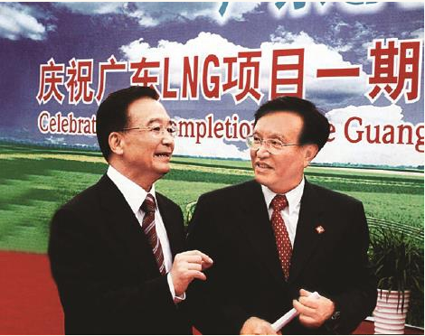

# 
 筚路蓝缕：世纪工程决策建设记述

### 
 “一石三鸟”的工程典范

广东LNG工程正式投产了。在隆重简朴的气氛中，温家宝总理和澳大利亚霍华德总理共同出席了这一象征中澳能源合作的盛事庆典。

 

 2006年6月28日，张国宝陪同中共中央政治局常委、国务院总理温家宝出席中国第一个LNG接收站——广东深圳大亚湾LNG接收站竣工典礼。

昔日寂寥的大鹏海湾，矗立起LNG接收站的伟岸雄姿。随着LNG运输船的一声汽笛长鸣，清洁能源从此将源源不断进入寻常百姓家。我有幸作为这个工程项目的策划者之一，亲历了8年的准备和建设过程。抚今追昔，特将我国首个LNG项目的决策与建设过程进行整理，以飨读者。

我国沿海经济发达，人口稠密，能源需求量大，但自给率很低。该地区以煤为主的能源消费结构和远距离能源供应，给环境和运输带来巨大压力。20世纪90年代初，我国开始研究使用LNG问题。1995年，我们着手编制天然气发展规划并组织有关单位开展LNG项目前期研究工作。1998年10月，国务院批准广东先行试点，引进LNG，拉开了我国进口液化天然气的序幕。这是推动能源结构调整的一项战略决定。

在国务院领导下，当时的国家计委统筹协调，项目实施采取了若干创新举措，开创了重大基础设施建设项目竞争性选择投资伙伴和长期资源供应商之先河。它不仅成功地实现了选定最佳伙伴和取得最佳供应资源条件等直接目标，而且通过竞争性选择过程，在社会主义市场经济的条件下，国家成功组织了运输招商、造船招标和燃气轮机技术引进国产化活动，实现了境外参股上游气田开发的既定目标，有效启动了我国LNG运输业与造船业起步，带动我国相关产业发展，创造性地走出一条引入竞争机制管理大型项目的新路子，成功探索了具有中国特色的LNG产业发展途径和大型天然气项目的管理模式。引进LNG试点工程的成功实施为我国扩大LNG使用提供了良好的示范作用，也在贯彻国家外交战略方面提供了宝贵经验，推进了我国与澳大利亚之间的友好合作关系。

#### 一、站线项目合作伙伴招商

由于我国是首次进口LNG，借鉴国外成功经验可少走弯路。为通过竞争选择合作伙伴，当时的国家计委下发了《关于广东LNG试点工程接收站和输气干线项目外商合作伙伴选择问题的批复》。广东LNG站线项目的对外招商活动，引起广泛关注。包括埃克森、壳牌、道达尔、英国石油公司（BP）在内的多家公司购买投资建议书，有10家组成集团或单个公司正式投标。经过第一轮招商竞争，形成埃克森申请集团（由埃克森和日本日商岩井、中部电力公司组成）、澳韩申请集团（由澳大利亚6家公司和韩国煤气公司组成）、壳牌申请集团（由壳牌和大阪瓦斯、丸红公司组成）和BP公司（单独）4家短名单。此后，进入第二轮招商竞争。根据4家公司提出的报价和合作条件，遵循“公平、公正、公开”原则，2001年4月最终选择BP公司为外商合作伙伴。

#### 二、资源招标

为招标选择资源供应方，当时的国家计委下发了《关于广东LNG试点项目一期工程LNG资源招标的批复》，主要包括贸易方式、参股上游、价格公式与原油挂钩系数取值、能源安全、运输条件、商务条款及操作预案等条件。

根据文件规定，项目业主坚持竞争原则，努力实现资源稳定可靠、价格具有竞争优势、降低资源供应风险，并按国际惯例谈判签订照付不议购气原则协议。据此，业主向澳大利亚、马来西亚、卡塔尔、印度尼西亚、俄罗斯、也门和伊朗7家发出招标邀请。广东LNG资源招标是涉及年进口370万吨LNG、合同长达20年以上、总金额高达120多亿美元的重大项目。巨大的商业利益，引起了各资源供应国政府和企业的高度重视。诸多国际石油跨国公司角逐中国市场，资源招标竞争十分激烈。2002年8月，经严格的招标程序和综合打分评选，澳大利亚具有资源可靠、供应安全、距离较近、向我开放上游资源投资、积极与我长期合作，同意中国海洋石油总公司参股12.5%澳大利亚西北大陆架气田等综合优势，最终选择澳大利亚为资源供应方。在资源招标中，建立了具有我国特色的LNG国际油价挂钩公式，争取到了国际上最优惠的价格。同年10月，签署中澳天然气技术伙伴关系基金宣言，由澳方政府提供2500万澳元支持中国发展天然气工业和推动两国能源合作。

#### 三、组建LNG运输公司

为培育我国远洋公司承运LNG，当时的国家计委下发了《关于广东LNG运输项目招商的批复》。由中远公司和招商局组成运输公司，通过招商选择具有LNG运输管理经验的国外航运公司合作，共同进行广东LNG运输项目可行性研究。为保证LNG由组建的运输公司承运，我们坚持按离岸价报价，到岸价作为参考，提出了包括运价在内的运输方案，成立了运输办公室负责运输和造船的招标工作。招商过程中，业主认真比选候选外商在经验、业绩以及财务和融资能力方面的条件，特别注意考察其承诺的合作条件是否支持以中方为主承运和造船。运输项目的对外招商活动，同样引起国外的广泛关注。业主向日本商船三井、日本邮船、川崎汽船，韩国SK，比利时EXMAR，新加坡GOLAR等6家船公司发出广东LNG运输项目可行性研究合作伙伴选择邀请函。根据LNG资源招标与澳方签署的《运输协议备忘录》，澳大利亚天然气公司（ALNG）中标后，ALNG自动成为广东LNG运输项目外商合作伙伴，其所承诺的合作条件和贡献（指为中国培训LNG人才）亦开始生效。

#### 四、造船招标

根据当时国家计委下发的《关于广东LNG运输项目招商的批复》规定，业主不仅应支持中方承运LNG，还应支持实现LNG船舶国内建造总目标。同时也应维护业主经济利益，引入竞争机制，采取国内船厂对LNG船舶建造可行性研究与国外船厂进行LNG船舶报价相结合方式，进行比较。运输办向大连新船重工、沪东造船厂、江南造船厂、南通中远川崎船厂发出广东LNG运输项目船舶建造可行性研究邀请函。与此同时，经由中外专家组成的评委会对船厂拟建船舶方案进行严格评估。2002年3月，上海沪东造船厂中标，承担广东LNG运输船舶建造任务。ALNG自动成为广东LNG运输项目外商合作伙伴后，推荐壳牌公司参加并协助沪东造船厂进行首船建造工作。因美国船级社（ABS）明确承诺以双重船籍方式协助中国船级社（CCS）实现LNG船检目标。经谈判，中国船级社（CCS）选择与ABS进行合作。沪东造船厂引进法国GTT公司（拥有薄膜型液舱技术专利）和法国大西洋船厂（拥有设计建造经验）技术。由美国船级社（ABS）和中国船级社（CCS）合作承担LNG船舶检验。按预定计划，首船于2004年7月开工建造，并于2005年12月下水，预计2007年11月正式交付运营。由沪东造船厂承建的第二艘LNG船亦于2006年6月顺利下水，开始内部安装。目前，沪东造船厂手持LNG船订单5艘，并已开始有国外订货，实现了我国生产LNG运输船零的突破。

这次招标的主要特点是：招标择优、以我为主、市场运作、统筹兼顾。在协调指导下，坚持市场运作；突出各环节统筹兼顾。国家计委从国家利益出发，对招标工作进行引导和核准把关，在4个方面做得较有特色，即：严格依法实施，强调公正评估，坚持综合比选，恪守国家利益。这4次招商招标活动，既是一个整体，又相对独立。上下一心，团结一致。每每遇到新问题，均通过协调、协商、协作，及时处理。终经艰苦商务谈判，得以完成并签署以照付不议为标志的重大商务合同群。

2003年9月，国务院批准广东LNG项目可研报告。同年10月，签署《中澳天然气领域技术伙伴关系基金启动谅解备忘录》，项目基金正式启动。12月，项目开工建设并完成站线项目、组建运输公司的登记注册。2006年6月，第一艘LNG船顺利抵达项目接收站，卸下第一船LNG进行运行调试工作。从前期工作到工程建设历时8年。通过中外全体建设者的共同努力，工程建设比计划提前1个月完成。广东LNG项目的胜利建成，是发挥我国社会主义制度集中力量办大事优势的又一体现。

总结建设广东LNG项目的基本经验，形成具有我国特色的广东LNG模式，这就是，以市场换资源，以中方为主承运与造船，通过招标对价格、工程等进行择优选择的三项基本工作方针。该项目实施过程中，在工程、技术、经济等方面都有所突破和创新。实践表明，发展LNG产业，已直接带动我国航运、造船、冶金、化工、机械电子、发电、金融、保险、城市燃气等相关产业发展，创造出显著的经济和社会效益。今后要按LNG发展规划，加快我国沿海地区引进LNG各项工作，继续全面开放和对外合作，加强管网和市场建设，推动天然气等清洁能源利用。

广东LNG项目的顺利投产，将极大缓解珠江三角洲地区能源紧张局面，并对该地区调整能源结构、改善生态环境、建设资源节约型和环境友好型社会起到积极促进作用。